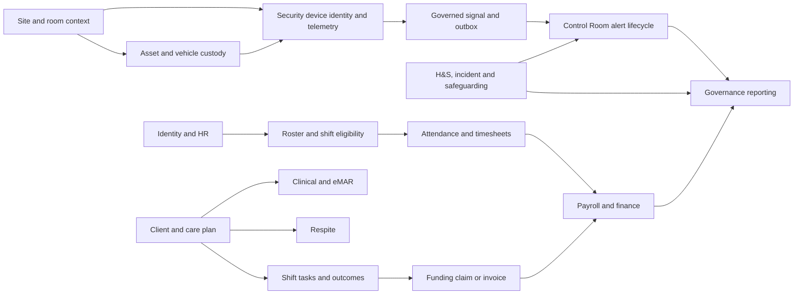

# Repository and module map

## Pinned source

- Branch `codex/backup-local-plans-2026-08-10`; HEAD `081ef198f9f992f224e8c0c9fba33df33dde40be`; reference `origin/main` `db3de89116fe498c29d5d96059da7d3f1df5fe3b`.
- 6,157 tracked files and 37 route files.
- 2,994 tracked-source route objects plus 30 provider/framework routes = 3,024 runtime routes. The additions are Fortify 24, Dusk 3, served-local-storage 2 and health `/up` 1.
- Runtime routes: 2,968 named and 56 unnamed; no duplicate names, duplicate method+URI groups or unresolved route actions.
- Two source career parameters become runtime slug bindings but are not added routes.

## Superseded 740-row capability projection

The following table is retained to show the earlier mechanical source projection. It is **not** the final accepted-capability allocation and must not be used as the completion denominator.

| Code | Module | Capabilities | Human | Routes | Resolver pages | Models | Policies | Services | Async artefacts |
|---|---|---:|---:|---:|---:|---:|---:|---:|---:|
| PUB | Public and marketing | 7 | 7 | 8 | 7 | 0 | 0 | 0 | 0 |
| AUTH | Authentication and account security | 9 | 8 | 19 | 5 | 0 | 0 | 0 | 0 |
| DAY | Frontline and My Day | 8 | 7 | 20 | 19 | 0 | 0 | 0 | 0 |
| OPS | Operations and rostering | 79 | 76 | 360 | 142 | 0 | 0 | 12 | 6 |
| CLI | Clients and supported people | 44 | 37 | 136 | 29 | 3 | 0 | 0 | 0 |
| MED | eMAR and medications | 39 | 36 | 197 | 47 | 27 | 1 | 12 | 1 |
| CLIN | Health and clinical | 12 | 12 | 55 | 22 | 6 | 3 | 8 | 2 |
| HR | Human resources | 132 | 129 | 632 | 137 | 131 | 6 | 46 | 15 |
| HS | Health and safety | 35 | 35 | 190 | 39 | 0 | 0 | 16 | 0 |
| INC | Incidents and safeguarding | 14 | 13 | 47 | 8 | 7 | 1 | 0 | 0 |
| PRIV | Privacy and compliance | 18 | 17 | 70 | 30 | 6 | 2 | 2 | 1 |
| FLEET | Fleet and vehicles | 38 | 37 | 157 | 61 | 0 | 0 | 9 | 0 |
| ASSET | Assets and equipment | 14 | 13 | 30 | 3 | 1 | 0 | 0 | 0 |
| SITE | Sites, facilities and catering | 58 | 52 | 225 | 78 | 1 | 0 | 9 | 0 |
| SEC | Security and devices | 25 | 21 | 89 | 22 | 9 | 1 | 4 | 1 |
| CR | Control Room | 29 | 28 | 108 | 21 | 25 | 0 | 7 | 0 |
| IT | IT and service support | 1 | 1 | 7 | 1 | 0 | 0 | 0 | 0 |
| FIN | Finance and funding | 51 | 50 | 243 | 91 | 60 | 14 | 47 | 26 |
| GOV | Governance | 27 | 25 | 145 | 58 | 55 | 13 | 13 | 10 |
| RESP | Respite | 23 | 22 | 99 | 44 | 16 | 0 | 0 | 1 |
| REP | Reporting and summaries | 5 | 5 | 12 | 4 | 0 | 0 | 0 | 0 |
| ROAD | Roadmap | 7 | 6 | 24 | 6 | 20 | 8 | 8 | 11 |
| SET | Settings and system access | 40 | 37 | 124 | 31 | 0 | 0 | 0 | 0 |
| PORT | Client and family portal | 7 | 5 | 11 | 6 | 0 | 0 | 0 | 0 |
| PLAT | Platform and shared infrastructure | 18 | 7 | 16 | 6 | 299 | 18 | 44 | 50 |

Fresh independent Pass-8 adjudication establishes **25 ownership modules and a corrected source-backed denominator of 904 capabilities: 790 human, 111 download/API and three machine-ingress targets**. The versioned 904 manifest adds the distinct ClientCondition collection lifecycle and ClientMedicalProfile singleton update. It contains 881 exact-current, five source-stable and 18 audit-assigned IDs. Static source provenance closes all 3,024 route identities and all 727 true Inertia-page identities. Accepted FEATURE-ID ownership remains 2,994/3,024 routes and 714/727 pages; classification is complete, mapping is not.

| Canonical module | Human | Download/API | Machine ingress | Total |
|---|---:|---:|---:|---:|
| Assets | 8 | 0 | 0 | 8 |
| Finance | 64 | 7 | 0 | 71 |
| Fleet | 48 | 1 | 0 | 49 |
| Reporting | 21 | 0 | 0 | 21 |
| Security and devices | 36 | 0 | 1 | 37 |
| Sites, facilities and catering | 68 | 2 | 0 | 70 |
| Authentication | 7 | 0 | 0 | 7 |
| Control Room | 34 | 3 | 1 | 38 |
| Frontline / My Day | 7 | 0 | 0 | 7 |
| Incidents and safeguarding | 14 | 5 | 0 | 19 |
| IT support | 2 | 0 | 0 | 2 |
| Platform | 1 | 0 | 1 | 2 |
| Client/family portal | 4 | 0 | 0 | 4 |
| Public | 4 | 0 | 0 | 4 |
| Respite | 21 | 1 | 0 | 22 |
| Roadmap | 7 | 1 | 0 | 8 |
| Settings | 34 | 0 | 0 | 34 |
| Clients | 23 | 4 | 0 | 27 |
| Clinical | 19 | 1 | 0 | 20 |
| eMAR / medications | 48 | 24 | 0 | 72 |
| Governance | 50 | 12 | 0 | 62 |
| Health and safety | 41 | 27 | 0 | 68 |
| Privacy | 17 | 3 | 0 | 20 |
| Human resources | 136 | 18 | 0 | 154 |
| Operations | 74 | 2 | 0 | 76 |
| **Total** | **790** | **111** | **3** | **904** |

This closes the 904 static identity/disposition gate, not the substantive pass or runtime gates. All 790 human targets have structural task scripts. Matrix 05 assigns 8,168/8,753 rows to 774 final IDs and 3,948/4,312 material rows to 715 IDs; 585 visual and 364 material rows remain unresolved. Runtime task execution and independently reviewed ease scores remain 0/790.

## Page and frontend map

- Tracked page tree: 962 files (931 TSX + 31 TS).
- Resolver-loadable non-test TSX: 917 = 702 backend render roots + 187 imported support pages + 28 orphan/unreachable candidates.
- Static Inertia renders: 738 calls / 713 unique literal names; 702 resolve and 11 currently missing targets. The missing calls occur in inactive/unrouted controller methods or routes redirected to unified tabs; they remain evidence gaps, not fabricated live pages.
- Production TSX universe: 1,507 files.
- Hero layers: 521 direct `PageHero` sites; 85 genuine custom hero/banner JSX usages; 50 wrapper-reference rows are tracked separately and not double-counted.
- Overlay layers are separate and overlapping, never summed: 659/659 custom usages statically classified (253 exact trigger relations, 144 source-inferred candidates, 262 unresolved/blocked); 477/477 primitive roots classified (242 exact relations, 235 unresolved); all 146 explicit trigger nodes pair into 145 roots. These are static relationships, not runtime interaction proof.

## Backend, data and quality map

- Controller directory: 512 PHP files = 496 controllers + 16 concerns/support; 490 controllers are route-referenced, five concrete controllers and the base controller are unreferenced.
- 666 Eloquent models + 2 traits; 67 policies (63 explicit mappings, convention/test-only and duplicate policy evidence retained); 237 service classes.
- 96 queued jobs, 14 events, 10 listeners, 4 outbox model/dispatcher artefacts, 29 observers / 39 registrations and 142 notifications.
- 773 migrations and a schema dump containing 636 tables.
- Tests directory: 881 tracked artefacts; 818 executable specs (606 Feature, 103 Browser, 76 Unit, 31 e2e, 1 Integration, 1 visual) plus 49 resource-JS specs = 867 executable specs. No dedicated `tests/Architecture` directory exists, although architecture/contract assertions occur elsewhere.
- Tests were mapped and read; none were executed.

## Ownership and dependency graph

The graph is a compact ownership view backed by the route/service/event traces in the feature matrix and findings. Security & Devices owns canonical device identity/observed state; Sites supplies place; Assets/Fleet supply custody/vehicle operations; Control Room owns the live alert queue; Finance owns GL; Governance consumes projections. Findings identify where current code violates these intended edges.
