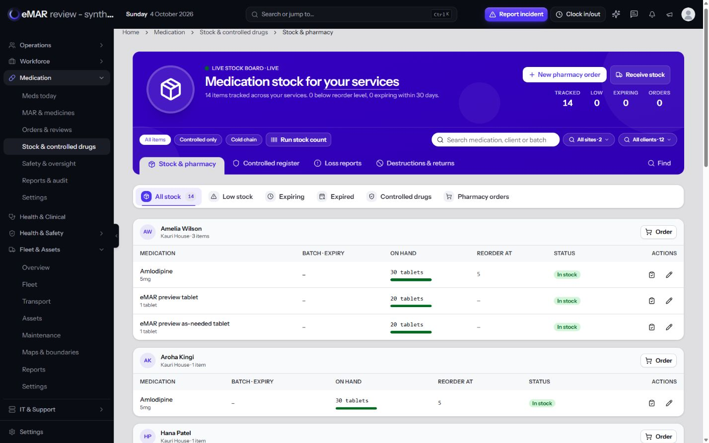
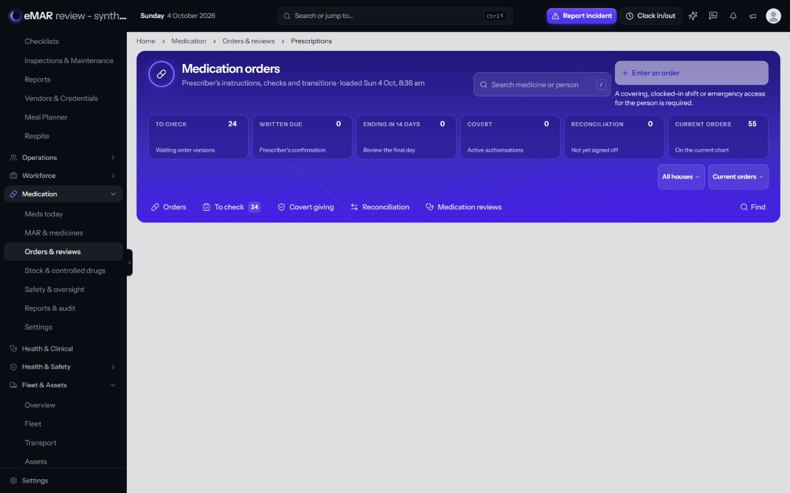
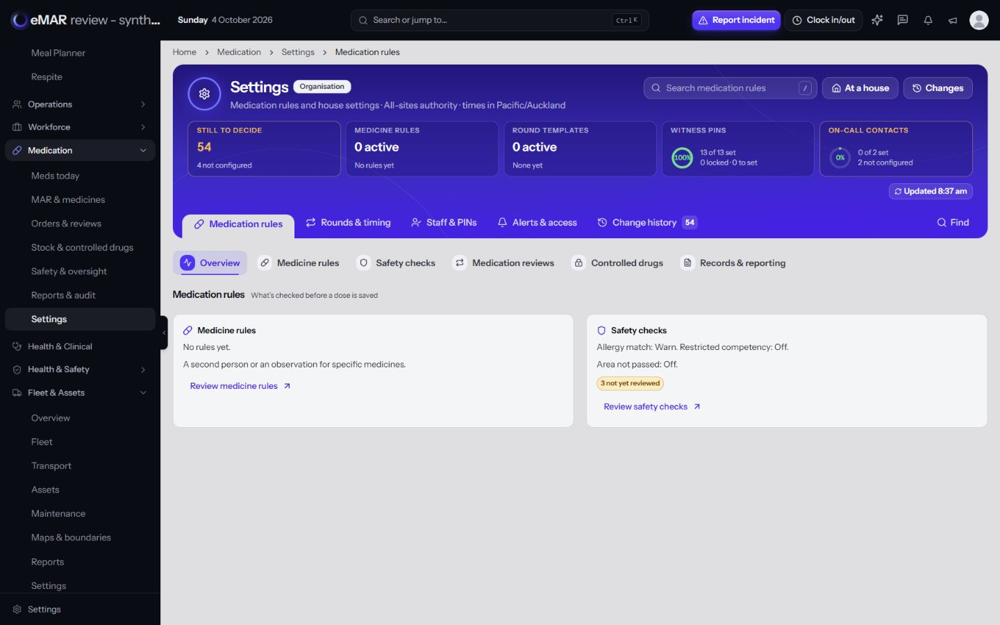

# eMAR hero and navigation re-audit — 4 October 2026

**Verdict: the module does not pass Rory's hero and tab acceptance rules.** Six of the seven supplied screenshots show the superseded hero and a white, bordered second tab bar. Settings is substantially closer, but its sub-tab geometry still differs from the current page-header specification. The earlier description of the module's headers as “Rory-aligned” was too broad and is withdrawn.

This is a focused design and navigation audit, not a clinical release assessment. No application code, permissions, feature flags, medication records or settings were changed. Existing clinical release holds remain in force.

## Evidence and limits

- Reviewed all seven user-supplied screenshots. Their medication records were not copied into this report or committed as images.
- Compared the primary checkout at `371014763` with integration branch `codex/emar-completion-20261003` at `9bfcec6677b3f4189eb61f88981ac30d5da01ef5`. All implementation paths and line numbers below refer to that integration revision unless explicitly labelled primary.
- Traced routes, controller component selection, configuration variants, header composition and navigation ownership. Two independent GPT-6.1 Sol Extra high reviewers checked heroes and navigation separately.
- Reproduced the canonical Stock page and the broken Reviews → To check navigation in the authorised synthetic preview at `http://127.0.0.1:8765`. Also inspected Settings. Desktop evidence uses a measured CSS viewport of 1440 × 900, with `app-DBMoLwNr.js`, the existing build documented at `029b7558f`. Later integration changes were tests/documentation. The temporary viewport was reset afterwards.
- PR #16 was still OPEN and DRAFT, with no merge commit. The newer integration screens must not be described as deployed. The primary source agrees with the older layouts in the screenshots; this does not prove the production deployment's exact commit.
- Automatic approval review initially blocked the signed-in production inspection because the earlier browser scope was local. The user subsequently gave specific approval: **“Allow read-only production eMAR audit.”** After that approval, the same live Chrome tab was inspected read-only. All seven entry pages were checked at the existing CSS viewport of 2113 × 976. Production loaded `app-BUpeRvLM.js`, different from the synthetic preview's bundle. No production screenshots or client records were exported into this report.
- Live inspection confirmed six legacy entry headers and six white page-level tab containers, plus the closer Settings header with five meters and a transparent section strip. It also confirmed Safety's additional nested Action centre strip. The original `/emar/settings#rounds/templates` page was restored afterwards. No production record, setting, permission or feature flag was changed.
- This pass did not re-run backend tests, exercise clinical writes, or complete every role/theme/1280px/200%-zoom combination. Source-complete header composition is not a visual acceptance pass.

## The applicable rules

| Requirement | Authoritative source |
| --- | --- |
| Use `PageHeader`; `PageHero` and right-column statistics are superseded | `DESIGN.md:92–139`; `design_styles/PAGE_HEADER_STYLE_GUIDE.md:21–32` |
| Compact identity: 48px ring mark, plain 22px title, one status/scope chip and one factual subline | `PAGE_HEADER_STYLE_GUIDE.md:145–166` |
| Scoped search and actions at the top; full-width linked meter row with heading, visual/number and caption; filters inside the header | `PAGE_HEADER_STYLE_GUIDE.md:43–58,171–277` |
| No greetings, “LIVE” eyebrows or extra fact/alert chip rows | `PAGE_HEADER_STYLE_GUIDE.md:157–166`; eMAR `Mockup-design-rules-checklist.md`, section A |
| Connected main-view rail: one line, active view visible, More overflow and Find; alignment owned by the shared component | `PAGE_HEADER_STYLE_GUIDE.md:299–357` |
| Second-tier tabs on the page background: no card, border, shadow or container padding; colours follow position | `NAVIGATION_STYLE_GUIDE.md:60–90`; `DESIGN.md:519–527` |
| Page-header sub-tab anatomy: 36px strip, 18px circular active icon disc, 3px underline; inactive icons are plain | `PAGE_HEADER_STYLE_GUIDE.md:359–376` |
| Lists use header views and filters, rather than an additional page-level sub-tab strip | `PAGE_HEADER_STYLE_GUIDE.md:95–98,375–376` |
| Settings specifically retains a header rail, section sub-tabs, Overview cards and draft-aware save review | `DESIGN.md:675–689`; 29 September eMAR mockup checklist, review process and recorded corrections |
| The shell owns the single 20px gutter; page sections use 20px gaps | `DESIGN.md:81–86,589–604` |

There is a real documentation/component mismatch: the older navigation guide specifies 40px tabs, 22px rounded-square chips and a 2px underline, while the page-header guide specifies 36/18/3 and circular active icons. Resolve that shared geometry explicitly. Do not delete Settings sub-tabs: the later, specific Settings instruction expressly requires them. Preserve the 44px effective hit area on frontline controls while correcting the drawn geometry.

## The seven screenshots

The header and tab findings in all seven supplied screenshots were also confirmed on their live entry routes after read-only approval. Integration state below is deliberately listed separately.

| Page | Supplied screen | Integration state | Required correction |
| --- | --- | --- | --- |
| Meds today | Legacy large icon, greeting, right-column statistics, extra alert chips, separate white views strip and repeated search | `meds/today/index.tsx:791` now composes `PageHeader`, linked meters, search, filters and its own rail | Compare the actual entry route with the approved design; keep all built views in one connected rail. New source is not proof that the supplied deployment was updated. |
| MAR & medicines | Legacy person hero, raw ISO date, hub rail plus white Schedule/Due-overdue/PRN/History strip | Legacy remains the default configuration; P02 record/hub paths also exist | Audit both supported branches. Person sub-sections may use one bare strip; cross-person lists must use header filters/views. Format the display date for NZ readers. |
| Orders & reviews | Legacy document icon/right-side counts; shared hub tabs plus white local tabs and another row of status scopes | `/emar/prescriptions` now serves `Orders.tsx:407`; the retained legacy screen is separately reachable | Finish the new meter anatomy; fix outgoing review links; preserve countersign, dispensing, covert and historical workflows when consolidating views. |
| Stock & controlled drugs | Legacy hero, white local strip, scopes repeated across filter pills and tabs | **Still the canonical `/emar/stock` implementation** | Migrate the actual entry route. The newer pack screen at `/emar/stock/packs` does not fix this landing page. Preserve held writer flags. |
| Safety & oversight | Legacy greeting hero, duplicated cross-hub navigation and repeated body metrics | `Index.tsx:725` now uses `PageHeader` and Safety rail | Verify new overview against the full contract. Its remaining `TabStrip` is inside Action centre, not a second page-level bar; replace that nested chrome with ordinary subsection filters while retaining urgent categories. |
| Reports & audit | Legacy reporting hero and white nine-view strip below the hub rail; repeated statistics | Canonical route now serves `reports/hub.tsx:92` | Verify every report mode, including locked/export states; retain all report families, print/export and audit permissions. History and builder still have separate header gaps. |
| Settings | Compact identity, full-width linked meters, scoped search and connected rail; bare sub-tabs | Same general structure in the draft; strongest of the seven | Retain its approved Settings structure. Reconcile shared icon/underline geometry and action hierarchy. It is a partial pass, not a reference to copy without inspection. |

## Findings and correction requirements

### H01 — High: active routes still select the superseded hero

`StockManagement.tsx:751`, `Rounds.tsx:506`, `Handovers.tsx:462`, retained `Prescriptions.tsx:653`, and the legacy MAR/medicines/PRN variants still render `PageHero`. The shared implementation at `components/page/page-hero.tsx:184–266` creates the large icon, generous padding, centred narrow layout and inline right-column statistics seen in the screenshots. Adding connected tabs or one new button component does not migrate the banner.

Replace the whole header composition on reachable pages, retaining each action, predicate, permission and data source. Use meaningful linked meters, not decorative boxes or invented charts. The primary checkout additionally retains the legacy hero on Meds today, Safety and Reports.

### H02 — High: the shared legacy tab strip directly violates Rule 2

`components/rostering/tab-strip.tsx:104` hardcodes `rounded-[14px] border border-border bg-card p-1.5 shadow-sm`. Its tone API selects caller-provided semantic colours (`:23–27,130`), rather than position. This is the exact white-card treatment in six screenshots and the synthetic Stock page.

First classify every tab as a main view, a list scope or a true record sub-section. Move genuine main views into the connected header rail, list scopes into header filters, and true record sections into the bare shared sub-nav. Do not merely remove the white background while leaving duplicate navigation. Do not recolour this shared Rostering component globally: HR, health and safety, attendance and other modules also depend on it.

### H03 — High: new page files and approved mockups are being mistaken for completed entry routes

`routes/emar.php:147` still resolves `/emar/stock` to `EmarController.php:2740` → `StockManagement`. The newer `StockHub` is selected only by `routes/emar-stock.php:11` → `/emar/stock/packs`.

`config/medications.php:8` defaults `person_record` to `legacy`. `EmarController.php:1248–1252,1688,2411` selects rebuilt P02 records only for the P02 configuration. The synthetic preview already uses P02, which explains why testing it alone misses legacy MAR. Do not enable a held feature flag merely to make a design check pass. Both supported configurations and aliases need explicit coverage, or a separately reviewed migration decision.

### H04 — High: Medication reviews sends two tabs to invalid Orders selectors

`reviews/index.tsx:95–99,702–704` sends To check to `?view=check` and Reconciliation to `?view=reconcile`. `Orders.tsx:65,611,762` expects `to_check` and `reconciliation`; `MedicationOrdersController.php:133` passes the raw value through.

**Browser reproduced:** open Orders & reviews → Medication reviews → To check. The URL becomes `/emar/prescriptions?view=check`; no header tab is selected, and no content panel appears, despite the header displaying 24 orders to check in the synthetic fixture. The Reconciliation mismatch is source-confirmed, not separately browser-exercised in this pass.

Use the canonical selectors from `lib/emar-navigation.ts`, with a validated/default destination for unknown values. Add a focused navigation regression for both links. This can be corrected without changing medication authorisation or enabling a writer.

### H05 — Medium: some new headers import the component but omit required anatomy

- `Orders.tsx:522–531` puts the number in the small meter heading via `value`, followed by a caption; it supplies no big-number/graph visual. The empty visual area is visible in the captured destination. Use a real number visual; inventing a percentage is unnecessary.
- `AuditLog.tsx:513–597` has extra outer padding, no meter row, search in the filter row and a separate date form below the header. Keep the working NZ date filtering and Back/Forward behaviour when relocating controls.
- `record/hub.tsx:214,249–264` mixes a forced 44px date field with compact filters and places search in the lower row. Use a consistent shared frontline treatment.
- `downtime/index.tsx:94–115` and `downtime/show.tsx:203` use heading-only meter blocks. Both omit search/filter composition and suppress Find at `:128` / `:237` despite rendering a rail.
- `SelfAdmin.tsx:101–113` uses ordinary input/outline-button controls in the header. `SupportRecord.tsx:131–241` omits scoped search/filters and uses a generic module mark on the individual record.
- `reports/history-logs.tsx:136–276` omits scoped search/meters; the shared report builder conditionally removes filters on its builder view (`reporting/workspace.tsx:1077–1108`). Specify an honest state-specific contract rather than filling missing rows with dead controls.

### H06 — Medium: Settings is structurally closer, but shared sub-tab anatomy has drifted

`Settings.tsx:817` uses the connected `PageHeaderRail`; `:1024` uses Fleet's `Sections`, which renders `TierTwoTabs` (`pages/fleet-assets/settings/_ui.tsx:19`). The container is correctly transparent, and tones correctly follow position.

However, `components/page/grouped-profile-nav.tsx:337,347,364` uses the older minimum-height, 22px rounded-square chip and 2px underline classes. **Live Settings measured 40px tabs, approximately 22 × 22px icon chips and a 2px underline.** In the synthetic 1440px preview, the strip measured 35px high, icon chips 22 × 22px, and the underline 1.75px under its current font scaling. Inactive icons also have a muted filled chip rather than being plain ghosts. The newer page-header contract calls for a 36px strip, an 18px circular active icon and a 3px underline.

Correct this through a bounded shared-component review that also checks Fleet and person profiles; preserve keyboard movement, focus, selected-panel relationships and the effective frontline hit area. Settings' two top actions are both glass controls (`Settings.tsx:767–791`); reconcile the primary-action rule with its existing Review changes workflow and read-only roles. Do not add a fake save or unnecessary clinical action just to create a white button.

### H07 — Medium: duplicate scopes and extra outer padding make the hierarchy inconsistent

Legacy Stock, MAR and Rounds add `p-6` and `gap-6` to their roots (`StockManagement.tsx:750`, `MarCharts.tsx:361,492`, `Rounds.tsx:505`), on top of the shell gutter. History adds `p-3 sm:p-6`. This explains the inconsistent inset between breadcrumbs and banners.

Some old strips combine actual destinations with status scopes: Stock mixes Pharmacy orders with Low/Expiring/Expired, Handovers mixes Activity with submission states, and retained prescriptions duplicates Covert. Maintain one navigation owner per level and put status predicates in header filters. Preserve urgent alerts as actionable safety messages where necessary; reducing repeated metrics must not hide unacknowledged clinical warnings.

### H08 — Medium: “live” and date labels need truthful, consistent wording

Old Stock, Prescriptions, Handovers, MAR and Rounds retain “live”, “synced” or “refreshed” eyebrows (`StockManagement.tsx:767`, `Prescriptions.tsx:669`, `Handovers.tsx:478`, `MarCharts.tsx:514`, `Rounds.tsx:526`). No polling/subscription mechanism was found in those page implementations; action-triggered reloads do not establish continuous freshness. Replace the legacy eyebrow with the loaded/updated time and genuine stale/failure state where appropriate.

New Meds today has explicit visible-page refresh and failure handling (`meds/today/index.tsx:294–324`); retain it. Settings has a real loaded timestamp and refresh control. Avoid hardcoding NZDT year-round (`StaffEligibility.tsx:312`); use Pacific/Auckland formatting that accounts for the selected date. Display ISO dates in readable NZ form while preserving underlying date values.

The supplied prescriptions screenshot has different headline/table counts. Their scope and meaning need verification before calling this a calculation defect. This audit makes no claim that those counts are wrong.

### H09 — Medium: inconsistent navigation ownership makes fixes fragile

`EmarHubRail` is explicitly mounted by pages; it is **not** injected automatically by the app shell. It suppresses itself for hubs marked `ownRail`, and derives its active view from the URL (`components/emar/emar-hub-rail.tsx:30–41`). Other new pages own their local rails. Copying another rail into all pages would introduce more duplicates and could lose page-specific workflows.

Reconcile each page against the canonical hub map, preserving permission filtering, the current server-authorised view, deep links and date/person/house context. Controlled discrepancies, pack counts/movements, medication effectiveness checks, dispensing and paper reconciliation must remain reachable even where the global hub map currently lists fewer views.

## Page inventory and safe navigation destination

This inventory separates reachable variants from obsolete files. “Current composition” means the expected primitives are assembled in source, not a complete visual pass.

| Reachable surface | Header / navigation now | Required disposition |
| --- | --- | --- |
| Meds today | Current composition, own connected rail | Retain Schedule, Rounds, As-needed, Follow-ups, Stock alerts, Activity and permission-gated Controlled checks; reconcile command discovery with the three views in the global map. |
| Legacy rounds `/emar/rounds` | `Rounds.tsx:506,568`: old hero and white Board/Chart/Templates/Activity strip | Put these genuine views in the header. Preserve template permissions and guided-round return paths. |
| MAR legacy, chooser and selected person | `MarCharts.tsx:362,493,578`: old hero, hub rail, white local strip on selected record | Chooser: header only. Person: compact profile header and one bare sub-section strip. |
| Legacy Medicines | `Medications.tsx:430,575`: old hero and list-scope strip | Retain All/Active/PRN/Controlled/High-risk/Awaiting as header scopes. |
| Legacy PRN history | `PrnRecords.tsx:661,805`: old hero and local strip | Retain Register, Reviews due, Near limit, Trends and History through main views or appropriate filters. |
| P02 MAR/Medicines/As-needed directory | `record/hub.tsx:113,272`: partial header, single rail | Correct search/filter geometry; retain all four MAR hub destinations. |
| P02 person record | `record/show.tsx:155,295,304`: profile header, grouped rail and bare subnav | Valid two-tier placement; shared geometry correction and full state/role verification remain. Preserve unavailable/no-access EmptyState (`:44–77`). |
| Support directory | `SelfAdmin.tsx:89,210`: partial header, MAR hub rail | Correct header controls; do not add another rail. |
| Person support record | `SupportRecord.tsx:131,215`: partial header, local rail | Preserve By medicine, Assessment, Agreement and Changes. |
| Orders | `Orders.tsx:407,577`: partial meter anatomy, single rail | Correct instruments and canonical selectors; retain Orders/To check/Covert/Reconciliation/Reviews. |
| Retained prescriptions | `Prescriptions.tsx:653,788`: old hero and second strip | Preserve original orders, countersign, dispensing, covert and activity access during consolidation. |
| Medication reviews | `reviews/index.tsx:542,695`: current composition, own Orders rail | Fix outgoing selector mismatch; retain review-state filters and all review actions. |
| Canonical Stock | `StockManagement.tsx:751,930`: old hero, shared hub rail and white strip | Migrate entry route without activating held stock writers; classify main views versus list scopes. |
| Pack stock workspace | `stock/StockHub.tsx:83,93`: current composition, local rail | Preserve Stock, Pharmacy orders, Counts, Expiring, Removals, Movements and permitted Controlled access; resolve landing/rail ownership. |
| Controlled register and redirected Losses/Destructions | `ControlledRegister.tsx:213,355`: current composition, local rail | Preserve Register, Discrepancies, Losses and Destructions; keep scoped sibling access to stock. |
| Safety overview | `Index.tsx:725,884`: current composition, shared Safety rail | Keep single header rail. Restyle Action centre's nested strip (`:1057`) as subsection filters. |
| Handovers | `Handovers.tsx:462,598`: old hero and white status/activity strip | Header scopes plus a clear Activity destination; preserve draft, submit, acknowledge, incoming and locked states. |
| Follow-ups | `Followups.tsx:123,230`: current composition, Safety rail | Preserve worker access through Meds today as well as manager oversight. |
| Medication errors | `MedicationErrors.tsx:192,196`: current composition, Safety rail | Verify role/empty/error states and retain incident links. |
| Staff eligibility | `StaffEligibility.tsx:304,500`: current composition, Safety rail | Correct date-zone wording; preserve eligibility counts and authorised actions. |
| Witness overrides | `WitnessOverrides.tsx:252,372`: current composition, Safety rail | Verify controls and permissions; no extra page-level strip needed. |
| Emergency access | `emergency/access.tsx:224,333`: current composition, local rail | Preserve Running now, authorised To review and History; reconcile hub discovery without duplicate rails. |
| Reports hub | `reports/hub.tsx:92,104`: current primitives, own rail, conditional meters | Retain Standard reports, Report builder, Audit trail and Print & exports; define honest locked/export states. |
| Report builder | `reporting/workspace.tsx:895,1111`: shared workspace with conditional filters/meters | Preserve Report library, Report builder and Saved reports, and scoped return to Medication; avoid changing other report domains inadvertently. |
| Medication history | `AuditLog.tsx:514,589`: partial header and separate date controls | Retain Timeline/Table/Needs review and loaded-record scopes; consolidate controls without losing working date/back navigation. |
| History change logs | `reports/history-logs.tsx:136`: partial header, no rail | Define list-header/sibling-navigation contract; do not add record subnav. |
| Settings | `Settings.tsx:758,817,1024`: current header, required bare section strip | Retain five main groups, all role-visible sections, hash deep links, draft guards and Review changes. Resolve shared geometry. |
| Downtime list and record | `downtime/index.tsx:68,120`; `downtime/show.tsx:177,230`: partial headers and local rails without Find | Complete truthful meter/navigation anatomy; preserve paper evidence, collection and reconciliation paths. |

Retained `ControlledDrugs.tsx`, `Destructions.tsx`, `Reviews.tsx`, `Reports.tsx` and `pages/medications/audit.tsx` still contain old patterns, but integration's canonical GET routes no longer select those renderers. Do not inflate active-route failures by counting them as live pages. No active route was established for `Placeholder.tsx`. `/emar/daily` redirects to Safety; guided rounds redirect to the worker board or legacy rounds; second-person confirmation endpoints return JSON and have no separate header to audit.

## Correction order and acceptance gates

1. **Correct the review-tab selectors and invalid-view handling.** Verify both outbound links and Back/Forward in the synthetic preview. This is a small independent repair.
2. **Freeze a page-and-route matrix before parallel design edits.** Include canonical entry routes, legacy/P02 variants, house/person/date context and the exact rail owner. Retain the seven role-aware sidebar hubs; no additional left-nav items are needed for this correction. Ordinary workers should retain their Meds today entry with clear next actions, while managers receive their permitted oversight pages.
3. **Finish the actual legacy entry headers.** Stock, Rounds and Handovers remain active; MAR/Medicines/PRN remain configuration-dependent. Use the real `PageHeader` family and approved mockups; do not hand-roll imitation banners.
4. **Consolidate tab hierarchy per page.** Main destinations go in one connected rail, list scopes in header filters, and record sub-sections in one bare strip. Keep the explicitly required Settings sections. Maintain every feature and safeguard.
5. **Complete partial new headers.** Prioritise Orders meters, history controls, person-directory filter geometry and downtime Find. Keep unknown/unavailable information honest and every displayed meter actionable.
6. **Reconcile shared sub-tab geometry in a separate bounded change.** Check Fleet Settings and existing profiles as well as eMAR. Preserve positional tones, 44px effective frontline targets, keyboard focus and selected-panel semantics. Do not apply an unreviewed global style replacement to `TabStrip`.
7. **Require actual route-level browser evidence before acceptance.** Verify 1440px, 1280px and actual 200% zoom; separately preserve frontline narrow-screen usability. Inspect light/dark and brand retinting, long labels, More overflow, Find, active-view visibility, empty/loading/error/denied states and supported roles. Exercise each tab destination and meter, not just the first screen. Keep alerts actionable and unsaved Settings drafts protected.

The result must remain a single-organisation application across approved houses/facilities. A visual migration must not alter role grants, site/person access, current eligibility, medication authority, record ownership, held feature flags or clinical release gates.

## Local browser evidence

All three saved screenshots below contain only the separate synthetic preview. No production screenshot was copied into the repository.

### Canonical Stock still uses the old hero and white second strip

### Reviews → To check reaches an empty destination

### Settings has the closer structure but older sub-tab geometry

The next implementation pass should close findings against this route matrix. Passing a build, importing `PageHeader`, or matching one mockup is not sufficient evidence to mark the whole module Rory-compliant.
