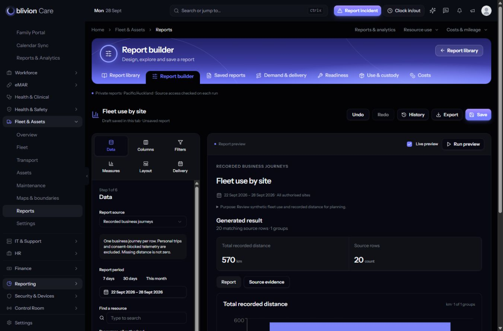

# Isolated Fleet consolidation QA packet

Status: local candidate ready for Main review, with genuine 125% browser acceptance still **UNVERIFIED**. No Main merge, push, publication or deployment was performed. The Reports owner is the sole writer of this candidate.

## Frozen candidate and inputs

- Candidate branch: `codex/fleet-consolidation-qa`.
- Tested source commit: `9782faab62efa0cabe518b0a799a3ad6cd1ffbb5`.
- Combined source reviewed independently by Main before the map correction: `f3fd2f77657c7fe09022ff69562e8c3487c9668b`.
- Main: `bb0eea61abe61a14d9b65af59f8bf1add88e8bb5`.
- PKG-03: `fbb0eda96586ca751b73382eb90720abd6b8721a`.
- PKG-08: `38239d35506bf97c4b6f865a13aa10933b4cb439`.
- People: `352ce7006098b227b945a47c4d55400c9aeff429`.
- Reports: `50716b9cca0473ee4082e329ce6ff1347833f714`.

All five exact inputs are ancestors of the candidate. [source-manifest.json](source-manifest.json) records all 569 changed paths, exact Git blob identifiers, input matches and the bounded reconciliation/QA exceptions. The final packet commit contains only evidence under this new directory; its parent identifies the tested application source above.

All 2,758 Main programme, historical evidence and guide paths were preserved at their Main input blob identities. All 386 pre-existing local branch refs remain unchanged; the only added branch is this candidate. See [main-preservation-final.json](main-preservation-final.json) and [reference-preservation-final.json](reference-preservation-final.json). No incoming package, Rory guide or Main programme file was dropped merely to make a merge succeed. Application authorization remains roles, permissions, approved Sites, canonical record ownership and privacy in this single-tenant application.

## Final verification

- Backend: **494 unique tests passed, 5,905 assertions, zero remaining failures or skips** across the final complete execution of each test class. This is an aggregate of the broad run and targeted corrections, not a single 494-test invocation. [backend-final-summary.json](backend-final-summary.json) gives each class's authoritative final XML and all earlier attempt totals.
- Frontend: **77 tests in 18 files passed**; full TypeScript no-emit check and scoped source ESLint passed. Scope and raw results are retained.
- PHP formatting: all nine final reconciled/QA paths passed Pint. Whole-file `routes/web.php` formatting remains a proven Main baseline exception: the same four fixers fail on the untouched Main copy. Only the two required route includes were added there; unrelated formatting was not rewritten.
- Production build passed in 3m57s, retaining the existing large-chunk warning. The served entry is `assets/app-khc5tsDn.js`, SHA-256 `87825ac974d5864819ce701ca3db22f3fd3eb6a06c977925061ff0a93591732f`. Build manifest and selected bundles are hashed. No frontend/build-input changes occurred between the build at f3fd2f776 and the final source freeze.
- Inventory: 307 relevant routes, no duplicate method/URI pairs or names, all 11 Fleet Settings routes, numeric vehicle-record evidence constraints and all 16 operational reporting routes retained. Finance notices/reminders and Reports schedules are present with their original overlap guards. Inventory inspection did not execute schedules.
- The authenticated synthetic desktop smoke verified Overview, Vehicle Finance, Settings drafts and map review, Fleet report generation/export freshness, People history/export reauthorization, both contextual client links, client reporting, staff session reporting and canonical map redirect. [browser-smoke.json](browser-smoke.json) records the exact surfaces and limitations.

The final history/architecture run passed **55 tests / 651 assertions**. The map/privacy/Overview run passed every relevant behavior case; its sole architecture fixture failure was subsequently corrected and the entire 45-case architecture file passed again. The original failed attempts are preserved so the chronology and scope are reviewable.

## Shared integration contracts

The five reconciled source paths are listed explicitly in the manifest:

- `IntegrationEventHistoryService`: interactive reads scan 501 observations per source, determine saturation before filtering invalid rows, and return at most 500. Report reads retain frozen per-source watermarks, lazy 500-row iteration, original contributor observation, received time, exclusive before boundaries and accuracy precedence. A zero watermark stays empty. The legacy identity ambiguity check is globally batched, including soft-deleted aliases outside the requested allowlist; it does not introduce per-device queries.
- `LoneWorkerController`: retains both SessionAccessService and SessionScope contracts.
- Client location workspace: retains both contextual Day & outing reports and Build report links.
- `routes/web.php`: includes both People Locations and operational Reports routes.
- `routes/console.php`: retains Finance review notices/reminders and Reports schedule execution definitions.

All four source package histories are retained. Integration regression tests exercise 500/501 boundaries, invalid rows, 601-row Reports reads, late arrival and zero watermarks, timestamp/accuracy behavior and batch ambiguity/query counts.

## MAIN-CONSOL-01 and bounded test corrections

The temporary synthetic probe proved that both asset-only permissions could receive raw coordinates from consent-blocked/personal snapshots and an alert count via the legacy map URL. The original [finding](LEGACY-MAP-PRIVACY-FINDING.md), failing XML and observations remain intact; [MAP-RESOLUTION.md](MAP-RESOLUTION.md) records the explicit subsequent authorization and correction.

Only two application paths changed after Main's f3fd2f776 review: `LiveMapController.php` and `routes/fleet-assets.php`. The legacy URL/name remains available as a compatibility-only redirect, requires Fleet read or geofence management, and emits no raw location or alert projection. Permanent tests deny both asset-only roles and preserve Fleet/geofence reader navigation. Canonical map tests still check approved versus unassigned Sites, alert authority, consent/personal-trip privacy and explicit secondary-Site access; `fleet.manage` alone is not treated as all-Site authority.

The other four changed paths are tests. IntegrationEvent fixtures now use the existing model creating hook rather than introducing schema or partition logic. The stale Fleet Overview architecture case follows DashboardController -> FleetOverviewService -> VehicleLocationService and preserves the canonical Site/privacy boundary. The separate legacy-field debt guard was not weakened.

The published architecture failure is historical evidence: [run 36360000862 / job 108735214135](https://github.com/Rory357/oblivionfindings/actions/runs/36360000862/job/108735214135). Its downloaded log is retained. This packet does not claim that hosted CI was rerun or that unrelated ControlRoomMyTasks debt was fixed.

## Browser result and mockup fidelity

Preview: [authenticated Fleet report builder](http://127.0.0.1:8974/fleet-assets/reports/builder), served from the isolated candidate on the dedicated synthetic preview database. Normal password/MFA authentication was used, without middleware bypass. The final browser view shows 20 source journeys and 570 km. Client and staff personal-tracker reports also generated results; staff location reporting requires a specific authorized session. Unknown observations remain Unknown.

The implementation retains the [mockup](../PKG-09B/corrections/mockup-builder-1366.png)'s purple header, six-step editor, adjacent preview, measures and chart composition. It is not pixel-identical: the authenticated application shell, current dark theme, permission-aware controls, purpose metadata and actual source values differ. No additional UI redesign was made during consolidation.

Desktop evidence was captured at 1366 x 900 (1351 px content width with scrollbar). The temporary viewport override was reset and the populated report tab was left open. No captured browser errors remain. **Genuine 125% zoom is UNVERIFIED**; the acceptance amendment remains pending Main/user. No repeat attempt, substitute zoom measurement or implied acceptance is included.

The XLSX download success was verified by the application's visible confirmation. Browser blob-download capture timed out, so this packet does not claim an inspected downloaded spreadsheet. The People export flow completed and closed after its access/reason checks; no browser-exported PDF file is claimed as inspected. Server export rendering/privacy are covered by the automated tests. Current People map staff counts remain separate from the completed historical session used for the staff report.

## Evidence custody and limits

All original failure logs and XML are retained byte-for-byte. Initial backend failures were six fixture storage omissions and two stale map response assertions. The intermediate manager expectation was corrected to require explicit secondary-Site assignment. The probe's two privacy failures are retained as pre-fix proof, not counted as final passing tests. The first frontend attempt's local pdfjs asset-resolution failures are retained; the runtime alias/copy was confined to this checkout and did not modify shared dependencies.

[packet-manifest.json](packet-manifest.json) hashes every packet file except itself and its checksum sidecar; [packet-paths.txt](packet-paths.txt) is the exact evidence allowlist. Raw log/XML byte preservation is specified in this directory's attributes file. [verification-summary.json](verification-summary.json) separates successful checks from baseline exceptions and browser limits.

Read-only cleanup verification found zero remaining test databases with this owner's exact consolidation prefixes. The dedicated preview database remains available. Other owners' databases, including `of_main_combined_history_20260928_*` and `of_main_pkg09b_review_20260928_*`, were neither pruned nor changed. No Finance request, provider change, notification setting, live device command or external delivery was submitted during smoke testing.

Untracked preview/runtime helpers and logs are excluded from the packet and source commit. They are not deployment inputs. This review packet is the handback in the Reports chat; no cross-chat message or Main publication is implied.
