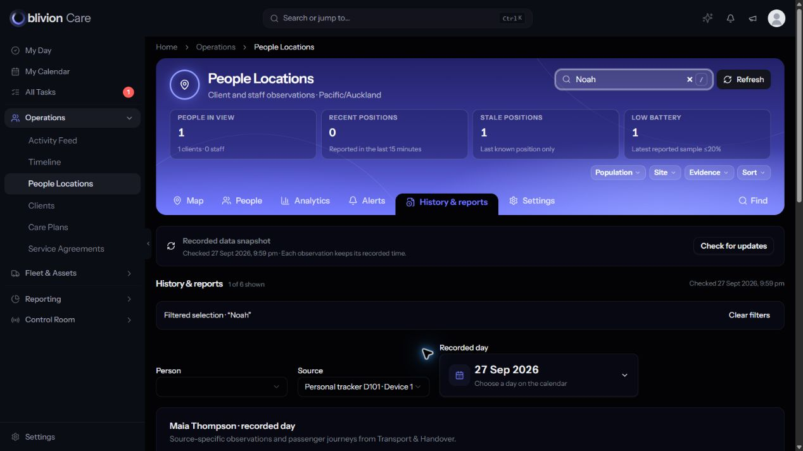
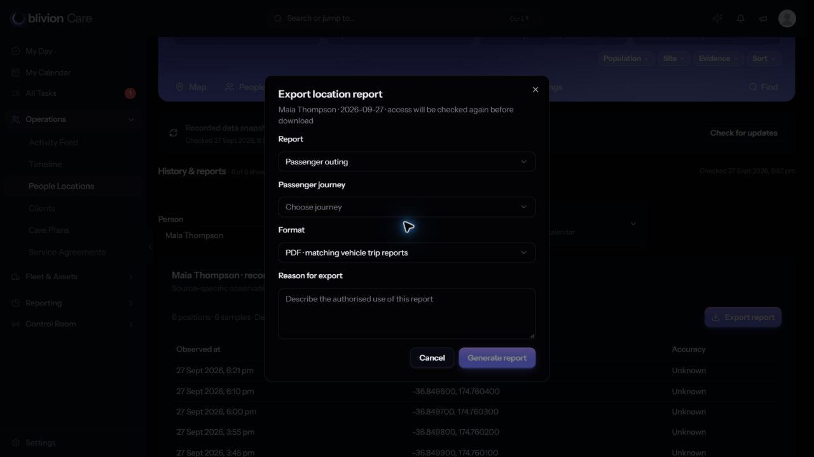

# People Locations implementation audit — 27 September 2026

**Further work required before acceptance.** This audit identifies 14 open findings. No application source was changed and no publication or other chat communication occurred.

All six People Locations views; approved v5; client entry; passenger reports; Control Room; current Transport and Maps integration; Rory's design rules. Read-only application audit. No product code changed or published.

Implementation base: a6b9fae6a73516548b02e64c41cf1fc94ce43f01. Main read at: 926b4981b0289da08a20baca0995117fb53e413e. Transport and Maps are now published to Main; the earlier integration note is superseded.

## Recommended implementation order

1. Correct UTC boundaries, resolve separate history access, and reduce repeated database reads.
2. Repair selection, response filters, export coverage and request cancellation.
3. Reconcile the current Main base; complete Settings, boundary context, shared pickers and report preview/timeline.
4. Verify daylight-saving boundaries, large streams, permission combinations, cancellation, keyboard/focus, genuine browser zoom and multi-page PDFs. Existing passing checks do not cover all these findings.

## PL-01 · P1 · Auckland day boundaries are sent to UTC queries without conversion

Classification: Confirmed defect. Area: Report correctness.

**Evidence:** The actual prepared journey bindings for 27 September are 2026-09-27 23:59:59 and 2026-09-27 00:00:00. The correct UTC boundaries are 2026-09-27 10:59:59 and 2026-09-26 12:00:00. FleetTelemetryEvent's day query also binds the zoned Carbon bounds directly. Position history already converts to UTC, so position and device streams can disagree.

**Impact:** Morning journeys and device samples can disappear. A historical day's device samples can include part of the next day. This also distorts reporting coverage and exports.

**Recommended change:** Calculate the Auckland interval once, convert every database bound to UTC, and use a half-open end boundary consistently. Recheck emitted samples against that interval.

**Acceptance:** Tests at Auckland midnight, a morning journey, an overnight journey, both daylight-saving changes, and observations immediately outside each boundary. Position and device streams must use the same interval.

Source: [app/Services/Tracking/PeopleLocationService.php:153](C:/Users/steph/.codex/worktrees/people-locations-implementation/oblivionfindings/app/Services/Tracking/PeopleLocationService.php:153). Related: PeopleLocationService.php:267–279; config/app.php:99; ClientLocationHistoryService.php:143–152.

## PL-02 · P1 · The approved separate history-access state is absent

Classification: Unresolved acceptance gap. Area: Access contract.

**Evidence:** workspace() loads retained history for a selected client on every view, including Map and Settings. history() reuses the same tracking access; only export has a separate new capability. Frozen v5 and the handoff explicitly distinguish location viewing, retained history and export.

**Impact:** The approved map-only versus history-enabled behaviour cannot be represented. This is a contract gap, not evidence of a new cross-site authorization bypass: the existing canonical client history surface also uses tracking access.

**Recommended change:** Resolve the history-access contract before activation. Enforce the agreed capability server-side and request history only on views that require it. Keep history out of map/settings payloads when not authorised or needed.

**Acceptance:** An agreed role matrix with map-only, history-enabled and export-enabled cases; direct requests and view switches must enforce it. No client-only UI gate is sufficient.

Source: [app/Services/Tracking/PeopleLocationService.php:80](C:/Users/steph/.codex/worktrees/people-locations-implementation/oblivionfindings/app/Services/Tracking/PeopleLocationService.php:80). Related: PeopleLocationService.php:248–264; approved v5 extension.js:20–26; OPS-PL01-DESIGNER.md History requirement.

## PL-03 · P1 · The refresh path performs hundreds of queries for six people

Classification: Measured release risk. Area: Performance.

**Evidence:** A read-only service invocation against the isolated synthetic database returned six people using 386 queries in 0.202 seconds. Consent type and version queries each repeated 56 times. This excludes HTTP middleware; the prior full-page observation was approximately 430 queries. Candidate people and streams are read before the selected-site filter is applied.

**Impact:** Every visible page refreshes at 30 seconds. Larger populations and concurrent operators multiply this load; chunking candidate reads does not bound the returned population or remove per-person work. The fast local timing is not a deployment-scale certification.

**Recommended change:** Scope candidate reads earlier; batch current authorization evidence within one request; avoid reloading full history on unrelated views; bound directory results and retain truthful aggregate semantics. Preserve fresh authority checks at release.

**Acceptance:** Set a query and latency budget, then test realistic site/population sizes and concurrent refreshes. Demonstrate revoked-access behaviour still passes after batching; do not cache authority across requests.

Source: [app/Services/Tracking/PeopleLocationService.php:46](C:/Users/steph/.codex/worktrees/people-locations-implementation/oblivionfindings/app/Services/Tracking/PeopleLocationService.php:46). Related: PeopleLocationService.php:91–114,148–191; PersonalTrackingPrivacyService.php:80–157.

## PL-04 · P2 · Search can blank the person picker while another person's report remains active

Classification: Browser-confirmed defect. Area: Selection and search.

**Evidence:** With Maia selected in History, searching Noah produces '1 of 6 shown' and a blank Person field, while Maia's source, observations and Export report remain active. selected is taken from all people but picker options come from filtered rows. Screenshot: audit-search-selection-mismatch.png.

**Impact:** The screen gives conflicting signals about whose evidence is selected, increasing the chance of the wrong report being opened or exported.

**Recommended change:** Keep the selected identity visible with an explicit 'outside current filters' state, or clear the selection and export action when it leaves the result set. Use the same rule on Map, Analytics and History.

**Acceptance:** Search, evidence filters, site changes, Clear filters and Back must never leave a blank picker paired with another person's active report.

Source: [resources/js/pages/operations/people-locations/index.tsx:212](C:/Users/steph/.codex/worktrees/people-locations-implementation/oblivionfindings/resources/js/pages/operations/people-locations/index.tsx:212). Related: index.tsx:282–303.

## PL-05 · P2 · Response drill-down filters are hidden and have no clear action

Classification: Source-confirmed defect. Area: Alert filters.

**Evidence:** Analytics writes alertStatus into the URL and the alert table applies it, but there is no status control or active-filter chip. The empty row tests alerts.length before the status filter, so an unmatched status can leave a blank table. Alert captions report the number of people rather than displayed responses.

**Impact:** Returning to Alerts can silently keep an old status restriction and conceal other active responses without explaining why.

**Recommended change:** Add a visible response-status filter with Clear, derive rows/counts/empty text from the same filtered collection, and preserve or clear it deliberately on navigation.

**Acceptance:** Open each response chart category, navigate away and back, and test a status with zero matching rows while other statuses exist. The applied filter and recovery action must remain visible.

Source: [resources/js/pages/operations/people-locations/index.tsx:975](C:/Users/steph/.codex/worktrees/people-locations-implementation/oblivionfindings/resources/js/pages/operations/people-locations/index.tsx:975). Related: index.tsx:1020–1030,1089.

## PL-06 · P2 · An outing is filtered after the day has already been capped

Classification: Source-confirmed gap. Area: Export completeness.

**Evidence:** The service first loads the latest bounded day streams, then the controller filters them to departure/arrival. A morning outing can lose all its samples when later activity fills the 500-record limit. CSV contains only position rows and has no partial-result/window metadata. The PDF's labelled authorised window remains the day window after outing filtering.

**Impact:** A recipient may mistake a partial or empty outing report for complete evidence, especially in CSV. An overnight outing is only a selected-day slice, which is disclosed in small PDF copy but not clearly at selection time.

**Recommended change:** Apply the passenger interval before limits, use a reliable truncation signal, and expose requested/effective window plus partial status in every format. Label day slices explicitly and distinguish them from a whole-journey report.

**Acceptance:** More than 500 day observations with an early outing; overnight journey; empty authorized window; source truncation; matching CSV/HTML/PDF scope and counts. No silent completeness claim.

Source: [app/Http/Controllers/Operations/PeopleLocationController.php:40](C:/Users/steph/.codex/worktrees/people-locations-implementation/oblivionfindings/app/Http/Controllers/Operations/PeopleLocationController.php:40). Related: PeopleLocationService.php:148–191; controller:99–108; pdf/people-location-report.blade.php:40.

## PL-07 · P2 · A report request has no timeout or cancellation lifecycle

Classification: Source-confirmed defect. Area: Export recovery.

**Evidence:** ReportDialog.generate() starts a fetch without AbortController or timeout; Cancel is disabled while busy. The outer workspace can unmount the dialog on visibility/access change, but the pending closure can still create the download when it resolves. The client also accepts any successful response body without validating its expected content type or redirect state.

**Impact:** A stalled export can remain busy indefinitely, and a late result can download after the user has left the report. Server-side final authorization is present and should be retained.

**Recommended change:** Abort on close/unmount/access change, bound the wait, ignore stale completions, and validate the expected download response. Provide a recoverable error with the entered reason retained where appropriate.

**Acceptance:** Slow/hanging request, navigation during export, hidden tab, permission loss, server failure and redirected/non-report response. No late download after cancellation.

Source: [resources/js/pages/operations/people-locations/index.tsx:1418](C:/Users/steph/.codex/worktrees/people-locations-implementation/oblivionfindings/resources/js/pages/operations/people-locations/index.tsx:1418). Related: index.tsx:1459–1473,1543–1558.

## PL-08 · P2 · Growing record pickers and the report popup do not meet the full shared contract

Classification: Confirmed design gap. Area: Rory's design rules.

**Evidence:** Person, Source and Passenger journey use unsearchable Select controls. Journey options show only 'Journey N'. The export popup uses bare DialogContent, rendering 448px wide with visible overflow, without the guide's width token/body structure. The current simple form fitted at 1280×720; clipping with long/error content was not established.

**Impact:** The controls become difficult to scan at operational volume and the export form looks less complete than the newer Transport dialogs.

**Recommended change:** Use shared searchable domain pickers with name/reference/date/destination context; retain canonical IDs. Apply the documented standard popup width, bounded body and reachable actions. Small fixed report/format choices can stay simple.

**Acceptance:** Long names, many records, no results, keyboard search/Escape/focus return, error copy, and short desktop height. Reuse current Main's corrected calendar/dropdown behaviour.

Source: [resources/js/pages/operations/people-locations/index.tsx:282](C:/Users/steph/.codex/worktrees/people-locations-implementation/oblivionfindings/resources/js/pages/operations/people-locations/index.tsx:282). Related: index.tsx:1475–1530; DESIGN.md:156–175; POPUP_STYLE_GUIDE.md:133–159.

## PL-09 · P2 · Settings remains an information page rather than the approved preference workspace

Classification: Approved feature missing. Area: Settings.

**Evidence:** The implemented Settings page contains refresh, links to Cards/List and one selected-source link. Frozen v5 includes personal default site/population/layers, save/cancel/review states and separate source reporting, routing, privacy and provider summaries.

**Impact:** Users cannot save normal workspace preferences or see enough context to understand reporting, retention and routing ownership. The page title overstates what is available.

**Recommended change:** Implement safe personal defaults and clear read-only summaries linked to canonical owners. Keep authorization revalidation mandatory; do not restore the mockup's Pause/manual-only behaviour as a way to stop privacy checks.

**Acceptance:** Save/cancel, reload persistence, inaccessible saved site, failed save, authority loss, inherited settings and unavailable source states. No duplicate consent, rule or provider store.

Source: [resources/js/pages/operations/people-locations/index.tsx:1282](C:/Users/steph/.codex/worktrees/people-locations-implementation/oblivionfindings/resources/js/pages/operations/people-locations/index.tsx:1282). Related: Frozen v5 base.js:59–60,109–110.

## PL-10 · P2 · The approved boundary context is missing and package assumptions are stale

Classification: Integration gap. Area: Maps and integration.

**Evidence:** PeopleMap receives people and selection only; it has no permitted-boundary overlay or layer control. The implementation links to Client Location, but its base predates the now-published Maps handoff and latest Transport dialog fixes. Main was read at 926b4981b; the old packet still says PKG-07 is not integrated.

**Impact:** Operators lack boundary context on the map, and this preview cannot establish end-to-end compatibility with the latest packages.

**Recommended change:** Reconcile this candidate with the exact current Main base. Reuse PKG-07's scoped geometry and actor-bound/revision-checked handoff through Client Location; add a read-only layer where authorized. Retest Transport and client report entry/return context.

**Acceptance:** Changed/retired/denied boundary, expired handoff, return context, current Transport modal behaviour, and integration regressions. Selecting geometry must never activate monitoring.

Source: [resources/js/components/people-locations/people-map.tsx:12](C:/Users/steph/.codex/worktrees/people-locations-implementation/oblivionfindings/resources/js/components/people-locations/people-map.tsx:12). Related: Main: app/Services/Tracking/BoundaryHandoffService.php; resources/js/components/client-location/boundary-handoff.tsx.

## PL-11 · P2 · Urgency is harder to see than the available data allows

Classification: Browser/source-confirmed gap. Area: Control Room usability.

**Evidence:** The alert payload carries severity but the Alerts table omits it. In the preview an open, high-severity response overdue by more than three hours appears as ordinary status, owner and date text. Map marker detail has no visible response summary; the response link is in its menu. Cards already use response severity.

**Impact:** Operators must open records or menus to distinguish urgent/unassigned/overdue work from ordinary responses.

**Recommended change:** Add explicit severity and overdue labels, response counts on the rail, and a compact original-response summary in selected-person map detail. Keep location freshness and response urgency separate and all response mutations in Control Room.

**Acceptance:** Critical/high/open/acknowledged/unassigned/overdue cases and independent Control Room denial; counts and links must use the same permitted originals.

Source: [resources/js/pages/operations/people-locations/index.tsx:980](C:/Users/steph/.codex/worktrees/people-locations-implementation/oblivionfindings/resources/js/pages/operations/people-locations/index.tsx:980). Related: PeopleLocationService.php:303–309; people-map.tsx Props; people-view.tsx:83–96.

## PL-12 · P2 · History is a coordinate table without the report-building experience

Classification: Approved workflow gap. Area: History and report UX.

**Evidence:** History renders positions as plain table rows, then device evidence and journey links. It lacks the approved map/timeline observation detail and distinct report preview. 'Day / outing report' from Analytics sets a report query parameter that is not consumed; the user must find Export report and choose again.

**Impact:** Day/outing reporting still feels bolted on, and a long day is difficult to inspect before exporting. PDF styling is shared with vehicle trips, but the surrounding workflow is less complete.

**Recommended change:** Provide an observation timeline with map selection and explicit gaps, plus a report preview that carries person/source/day/journey context. Offer report actions on the journey row. Keep non-vehicle outings unavailable until an authorized canonical owner exists.

**Acceptance:** Client profile, map and Analytics entries land on the intended report context; day/outing switching retains the correct source and window; empty/partial reports explain limits before download.

Source: [resources/js/pages/operations/people-locations/index.tsx:970](C:/Users/steph/.codex/worktrees/people-locations-implementation/oblivionfindings/resources/js/pages/operations/people-locations/index.tsx:970). Related: index.tsx:1110–1278; frozen v5 extension.js:24–26.

## PL-13 · P2 · Selection and refresh rebuild the map instead of retaining interaction state

Classification: Source-confirmed UX risk. Area: Map continuity.

**Evidence:** WorkspacePage is keyed by the complete URL. Selecting a person changes the URL and remounts the map, which fits all points and then pans. Marker updates clear and recreate every layer, including a focused marker or cluster chooser.

**Impact:** Operators can lose zoom, camera position and keyboard/popup context while moving between people or during refresh. Exact cluster focus behaviour needs a targeted browser regression.

**Recommended change:** Preserve non-sensitive camera/view state independently of evidence, update markers by stable IDs, and return focus deliberately. Continue clearing personal evidence on lost authority.

**Acceptance:** Pan/zoom, select two people, open a cluster, wait for refresh, use keyboard menus, and return with Back. No lost camera/focus and no resurrection of revoked evidence.

Source: [resources/js/pages/operations/people-locations/index.tsx:93](C:/Users/steph/.codex/worktrees/people-locations-implementation/oblivionfindings/resources/js/pages/operations/people-locations/index.tsx:93). Related: people-map.tsx:72,83,195–198.

## PL-14 · P3 · Prioritize actionable age and response views over adding chart volume

Classification: Improvement proposal. Area: Useful analytics.

**Evidence:** The current implementation has the donut, site comparison, battery bands, response distribution, battery trend and hourly coverage. However, unknown source states remain broad, battery bands include old samples, and person history sits far below the snapshot panels.

**Impact:** The screen is visually richer but still asks operators to work out which stale data or outstanding response needs attention first.

**Recommended change:** Add stale-age and battery-sample-age context, clearer source-choice/unsupported/absent distinctions only where canonical evidence supports them, and shortcuts into exact problem cohorts. Consider separate snapshot/history focus modes. Add historical response trends only when approved retained lifecycle data can support them.

**Acceptance:** Every metric states its population, time window, unknown denominator and action. No inferred safety, attendance, charging duration or invented trend. Validate usefulness with an operator task, not graph count.

Source: [resources/js/components/people-locations/analytics.tsx:287](C:/Users/steph/.codex/worktrees/people-locations-implementation/oblivionfindings/resources/js/components/people-locations/analytics.tsx:287). Related: model.ts:Position/Person types; analytics.tsx:842–1110.

## Verified strengths

- Shared header, cards/list, search, menus, chart hierarchy and light/dark visual alignment are implemented; this is not a recommendation for a rewrite.
- Map hover/focus and right-click actions exist. Clusters, marker/list fallback and recorded timestamps are present.
- Control Room links use original records and independent read access. Passenger reports use FleetResidentTransport rather than an obsolete parallel outing model.
- Exports have separate permission, required reason, durable audit and a final server-side authority check. Vehicle and people PDFs share the same report styling.
- The prior checks recorded 16 backend tests, 65 existing safety regressions and 12 frontend tests passing. This audit did not rerun those suites, and those results do not cover all new findings.

## Audit limits

- No operating data or production activation; diagnostics used the isolated synthetic preview only.
- Normal authenticated Chrome preview works. The in-app browser displays the ordinary login form in its separate browser session; no authentication bypass was performed.
- A short desktop viewport of 1280×720 was inspected. Genuine browser zoom, full accessibility certification, high-volume load and multi-page PDF stress remain unverified.
- Latest related chats and Main source were read; no other chat was messaged and no Main/sibling checkout was changed.
- Application source remained unchanged in this audit. Findings are open, not represented as fixed.

## Browser evidence

Search is Noah, the Person field is blank, but the retained selected report is Maia:

The export popup at 1280×720 fits this simple content, but uses a 448px default shell rather than the documented form token:

