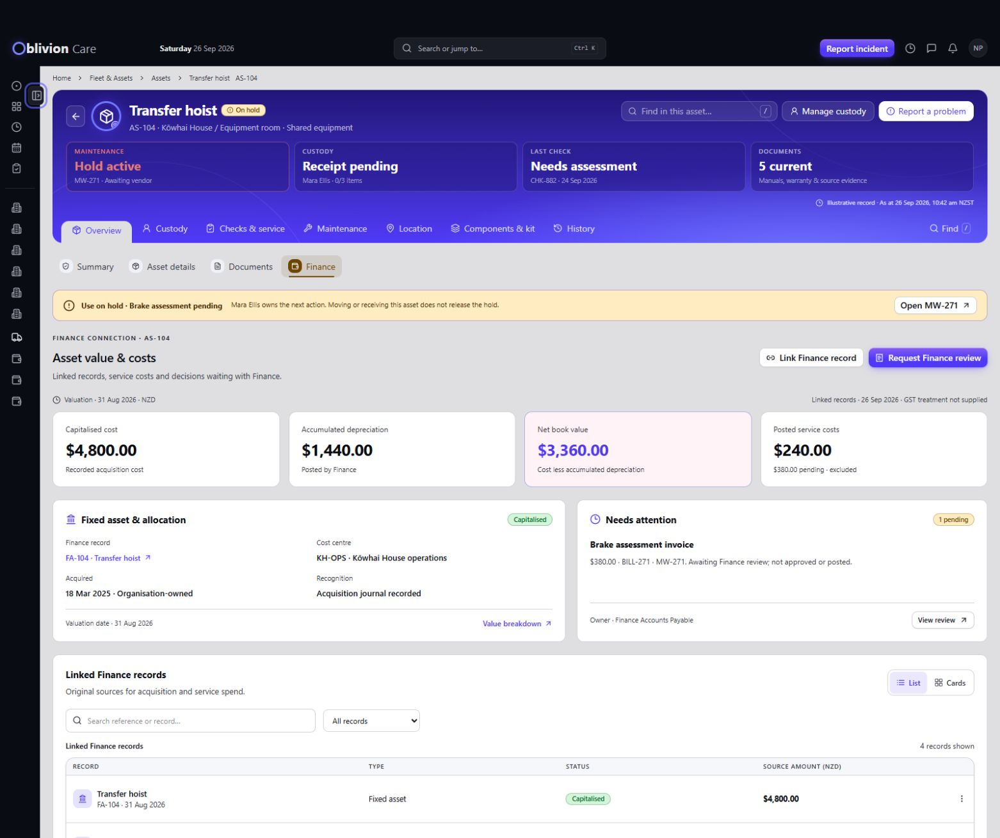

# PKG-06B Asset Profile — v7 Finance candidate

Design-only revision of AS-104, Transfer hoist. Awaiting Stephan's mockup review.

[Open Finance preview](http://127.0.0.1:8902/#view=overview&section=finance&scenario=normal) · [Review and gaps](../evidence/PKG-06B/v7/REVIEW.md) · [Candidate manifest](../evidence/PKG-06B/v7/manifest.json)

Finance now follows Vehicle Profile's linked-record, allocation and review pattern, with dated valuation, itemised source costs, local linking/request flows, source dialogs and exception states. Canonical decisions remain in Finance. This candidate does not approve expenditure, post journals, make payments or dispose of fixed assets.

Preview source: ../previews/PKG-06B/v7/. Final app.js SHA256: 0be1004349f40f57e932dc792d71d6b88e8306f07f5a61fbb24aa701d4d80d28.

23 focused keyboard checks passed. A retirement navigation defect found during testing was fixed and retested. No captured runtime errors. Candidate TypeScript is clean; one existing imported PageHeader diagnostic remains. Pointer and genuine zoom checks remain unverified. All 46 v6 manifest files are unchanged.

