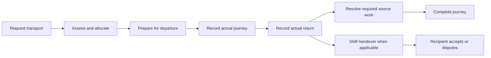

# PKG-05 v1 — audit of the complete delivered mockup

**Verdict: rework before design approval.** The preview covers many requested topics, but the journey is hard to understand and several alternate paths contradict the visible safeguards. Passing the earlier scripted route did not establish that the design was coherent.

This audits the frozen v1 runtime `7eebde36164679bd80f33ab63a62d2e3b8d6f276643ad5c92ab69d959dc4f07d`, the authored composition/helpers/styles, build/server/freeze scripts, review packet, source mapping and previous verification. Seventeen additional browser probes exercised alternate paths, state changes, recovery and journey layout. Their results and 13 screenshots are saved beside this report. Priorities below concern the **synthetic mockup and its suitability for approval**; these are not claims that the deployed application has the same defects.

The frozen v1 files have not been edited. All 62 manifest-listed files still match their hashes. The audit's evidence and recommendations are separate. No operational records, backend, shared components or application routes were changed.

## Why the journey feels confusing

The interface makes staff navigate the storage structure: request TR-1042, booking BK-208, journey J-608, receipt RC-311, key event K-771 and handover HO-87. Those references are useful evidence, but four large header tiles and repeated panels give them more emphasis than the person's current trip and the next action.

The request, booking and journey use nearly the same body and one shared stage. Even the booking body is titled “Journey plan.” The journey repeats the requested window, assessed needs, requester and allocation explanation before showing passenger progress. There is no clear planned-versus-actual departure/arrival presentation. The user has to remember what was already done and infer what each status refers to.

In the measured 1440×1000 view, the passenger/medication panel began at approximately **y=1,539**, and after return the **Complete journey** button was at **y=1,986**. The prominent action above it was **Hand over to next shift**. This visually implies that handover is the next compulsory trip step, although journey completion and shift custody are separate decisions. See `journey-results.log` J01/J02 and `screenshots/J02-returned-journey-full.png`.

## Findings, ranked by impact

### F01 · P1 · Checkout can bypass assessment and allocation

**Reproduced:** open the untouched requested TR-1042 → Checks & evidence → Open checks → submit the illustrative check → confirm passenger/keys/kit → Record checkout. The preview records checkout and shows BK-208/J-608 even though no vehicle or team was allocated.

The checkout handler validates checklist/observation values but never requires the assessed/allocated state or assigned vehicle/driver. Related header actions also open allocation before assessment. This contradicts the central sequence being presented for approval.

**Change:** define permitted transitions once and use them for every action entry, including header tiles, evidence tabs, contextual routes and retry paths. An unavailable action should explain its missing prerequisite and lead to it. Do not manufacture linked references from the resulting display stage.

Evidence: A01, `screenshots/A01-checkout-without-allocation.png`; [preview source](C:/Users/steph/.codex/worktrees/b9b9/oblivionfindings/docs/fleet-assets-audit/previews/PKG-05/v1/app.tsx:165).

### F02 · P1 · Recording an exception destroys handover state

**Reproduced:** dispute HO-87 → Assign reconciliation → Record exception → Return to transport. The dispute disappears and the page offers Acknowledge receipt again. A second path records a missing-key exception before any return/handover, then opens Custody; it also displays a pending recipient with an acknowledgement button.

`setHandover('exception')` puts exception ownership in the same field as pending/accepted/disputed. The render's fallback treats that value as a pending handover. The screenshot still contains a “Handover disputed” toast while the main page asks for acknowledgement.

**Change:** store exception ownership independently of the actual handover lifecycle. Assigning reconciliation must retain the dispute and original parties/evidence. No pending handover or acceptance control exists until the source has a real handover to accept. Resolution must be an explicit, attributable source action.

Evidence: A02/A07, `screenshots/A02-dispute-became-pending.png`, `screenshots/A07-acknowledgement-with-no-handover.png`; source lines 140–145 and 169.

### F03 · P1 · “Original receipt” recovery reads changed draft data

**Reproduced:** Return receipt retry → submit the default 48,248 km return → simulated lost response → Back → change odometer to 48,999 → Check receipt RC-311. The supposedly original receipt now shows 48,999.

Receipt detail is rendered from current form variables rather than a recorded event snapshot. The design says that original observations are retained, but it demonstrates mutation instead. Similar shared fields feed key/history details before/after other actions.

**Change:** keep immutable synthetic saved events separate from editable drafts. Recover the original receipt exactly. If input changed after an uncertain response, identify the original operation and offer an explicit subsequent correction; do not replace its payload.

Evidence: J04, `screenshots/J04-original-receipt-mutated.png`; source lines 166, 188 and 202.

### F04 · P1 · Denied access is not applied to linked detail

**Reproduced:** Access denied → click the generic Maintenance navigation entry. The preview opens the linked M-318 report, CHK-441, Koru's identity and “Ramp does not latch securely,” while the page behind it says the transport record is unavailable.

The earlier denial check examined only the body text. The generic source-dialog dispatcher does not apply the denied scenario and maps “Maintenance” to the fixture's report. This invalidates the mockup's claim that the denied example demonstrates the complete record boundary. It is not evidence of a production authorization vulnerability.

**Change:** model distinct permitted destination/list access and direct linked-record access in the fixture. A generic workspace link must not resolve to a denied object's report. Exercise secondary links, notes, evidence and searches under the same scenario.

Evidence: P01, `screenshots/P01-denied-linked-maintenance.png`; source lines 81, 199 and 211.

### F05 · P1 · The proposed journey lifecycle does not yet map to its canonical service

Allocation immediately invents J-608 in the preview. The inspected `ResidentTransportJourneyService::create()` instead creates an **in_progress** actual journey with a supplied **departed_at** and the authenticated actor as driver. An allocator assigning another worker cannot simply use that contract as the illustrated “link a planned journey” action.

The preview also blocks journey completion whenever `maintenance` is true. The inspected `complete()` method has source medication-custody/packing-attestation guards, but no blanket Maintenance-hold guard. A completed passenger movement and an unavailable vehicle are different facts. No approved rule was established for the extra blanket block.

**Change:** specify exactly what allocation produces, when the actual journey starts, whose authority records the driver/departure, and which original service controls completion. Present planned transport as a projection of request/reservation unless an approved planned-journey contract exists. Keep vehicle restrictions visible and authoritative for vehicle use/release without inventing a journey-completion policy.

Evidence: [journey creation](C:/Users/steph/.codex/worktrees/b9b9/oblivionfindings/app/Services/Fleet/ResidentTransportJourneyService.php:344), [journey completion](C:/Users/steph/.codex/worktrees/b9b9/oblivionfindings/app/Services/Fleet/ResidentTransportJourneyService.php:468); preview lines 164 and 191–193. This is an unresolved design/implementation-contract issue, not a request to weaken the real service's safeguards.

### F06 · P2 · Journey identity, actions and information order need redesign

The four reference tiles, module tabs, record tabs, progress strip, repeated linked-record panel and long explanatory banners compete with the actual journey. “Open record,” “Open source,” “View handoff” and “History” do not identify their destination clearly. The journey's essential work is below repeated request and vehicle summaries.

After return, the primary button asks for a shift handover while completion is at the page bottom. “Actual custody, acknowledged” is the handover card title even when no handover has been sent or accepted. The same “Return received” chip appears on request, booking, journey and handover views without saying which lifecycle it describes.

**Change:** keep the approved shell/PageHeader, but give the transport record one dominant identity, a concise current-state summary and one relevant primary action. Move IDs into a compact linked-record section. Put passenger progress, actual departure/arrival and remaining source work beside the action. Show optional/applicable shift handover separately. Replace generic destinations with “View vehicle booking,” “View return receipt” and “Open passenger return record.”

Evidence: J01/J02, both full-page journey screenshots; preview lines 80–138, 156–157 and 214.

### F07 · P2 · Cancellation gives contradictory progress and queue status

**Reproduced:** cancel a fresh, unassessed request. The progress strip marks Request, Assess, Allocate and Travel done, with Return current. Cancel an allocated request before departure: the queue still says Allocated and offers Open linked journey.

Keeping the underlying booking/custody obligation open is correct, but it does not justify hiding the request's cancelled outcome or showing travel as done. The shared `stage` and separate `requestOutcome` are projected inconsistently.

**Change:** display request outcome independently from booking, actual journey and custody state. A cancelled request should show “Cancelled · booking review needed,” where applicable. Skipped stages must not be marked complete. Preserve live return work with its own status and owner.

Evidence: A05/A06, corresponding screenshots; source lines 53, 116, 148, 153 and 168.

### F08 · P2 · Edits do not consistently update client, site, support and role context

**Reproduced:** submit Jordan at Kōwhai with no escort/wheelchair need. The new record still contains Aurora pickup/return defaults and an Aurora Site context link, and the summary still says “Escort requested · 3 occupied positions.” Allocation still presents one wheelchair position and a required securement kit. Journey passenger text also hard-codes Alex.

Initial pickup/return suggestions may be editable, but the interface does not warn that they no longer match the selected site. Request creation has an unused `passengers` field; there is no complete capacity configuration. The allocator is named in history but not clearly distinguished from the permanent request owner. The app avatar remains Mia while handover actions simulate Ben.

**Change:** derive all visible facts and links from the active request and actual source results. Reconfirm dependent pickup/return fields when site changes. Capture necessary capacity/support without adopting a wheelchair/escort default for every request. Show Requester, Allocator, Driver, Escort and Current holder with specific purposes. Put synthetic role switching in preview controls, not an ambiguous mixed-actor product screen.

Evidence: A04, `screenshots/A04-stale-context-after-new-request.png`; source lines 18, 50, 61, 106, 118, 123, 127, 134, 181 and 185–186.

### F09 · P2 · Drafts, new requests and exception reasons share state incorrectly

**Reproduced:** select Koru during allocation, close and choose Discard draft, then reopen allocation; Koru remains selected. Create a new request after adding a note to the original request; the old note and history appear on TR-1044.

Most discard actions reset neither the form nor its saved baseline. `reason` serves cancellation and exceptions; changing one can change the displayed explanation for the other. Scenario reset also leaves some notes, evidence, observations and other fields alive. The one-specimen limitation was disclosed, but changed identities should not inherit unrelated evidence or contradictory state.

**Change:** use per-record fixture state, immutable events and per-operation draft snapshots. Keep, discard and resume need distinct behavior. Reset scenarios completely. Preserve another request's records separately rather than relabelling shared state.

Evidence: A03/J05 and screenshots; source lines 28–43, 61, 70–77, 110, 128, 162, 168–169 and 245.

### F10 · P2 · Observation validation and review are incomplete

**Reproduced:** a return dated 25 September is accepted for the 28 September trip. The handler checks valid syntax, but does not reconcile chronology with checkout/departure. There is no explicit correction workflow despite error text mentioning one.

Request validation omits practical completeness checks for pickup/return and capacity; the review omits some entered location detail. Wizard navigation allows users to advance with incomplete fields and a generic “Completeness” percentage measures filled values rather than readiness. Return giver/receiver/site changes bypass the dirty flag.

**Change:** validate the relevant source chronology with a clear correction route where corrections are allowed. Review actual parties, locations, times and requirements together. Show section-level missing information instead of equating 100% filled with approved. Track all user edits and move focus to actionable errors. Required operating rules must come from approved configuration, not this audit.

Evidence: J03, `screenshots/J03-return-before-departure-accepted.png`; source lines 162, 165–166, 185, 188 and 217.

### F11 · P2 · Recovery messages survive successful recovery

After recovering RC-311 and opening the journey, the page still displays “Receipt acknowledgement was interrupted. Check receipt RC-311 before sending again” below its completion controls. The original receipt exists, yet the user is still told it is uncertain.

**Change:** scope error state to the operation; replace uncertainty with the recovered receipt and its recorded values. Keep the interruption in history if useful, but remove it as the current actionable error. Use status severity consistently; a generic green-tick toast should not be the only signal for unresolved work.

Evidence: J02 screenshot, source lines 166, 188, 196 and 214.

### F12 · P2 · Queue and recovery paths are too shallow to evaluate the design

The Journeys tab shows one active specimen or “No journey linked yet,” while the request queue already includes another allocated shopping trip. There is no useful journey list with period, driver, vehicle, passenger progress, current trip state or next action. The Outings view is one explanatory card. The needs-information row describes an owner but offers no way to provide or request the missing information.

A persistent allocation conflict tells the user to change the time or choose another vehicle, but the preview offers neither a date-change route nor a second suitable resource. Secondary records generally open explanations rather than functioning record views. Arbitrary unknown journey URLs also render J-608 instead of a not-found state.

**Change:** use a small set of genuinely independent fixtures covering requested, awaiting information, planned, active, returned and cancelled work. Add the specific recovery action called for by each message. Demonstrate the destination and return route, even if the operation remains synthetic. Resolve unknown identifiers explicitly. Do not build a second Fleet calendar.

Evidence: J06/J08 and A06; source lines 48, 68, 147–178 and 205–207.

### F13 · P2 · Search, filters and navigation do not match their apparent function

On the journey record, “Search transport…” does not affect the visible record. The chevron-labelled site and outcome filters cycle values instead of opening a chooser. Hidden query state can then affect the queue when the user returns. The Fleet navigation entry goes straight to this transport specimen rather than the published Fleet landing; importing the seven labels does not reproduce the full navigation contract.

**Change:** use actual filter choices, with clear applied state/reset. Keep list search on lists, or give detail search a defined purpose. Preserve meaningful back context per route. Let out-of-scope navigation clearly identify a preview boundary rather than silently substituting a different destination.

Evidence: A08/J07; source lines 59, 94, 96, 153, 211–212; published `resources/js/lib/fleet-navigation.ts` Fleet landings.

### F14 · P2 · Evidence and original-check demonstrations imply more than they contain

The failed-check flow links CHK-441 without recording a submitted failed check; the failure scenario already says “Failed check linked to Maintenance” before the link succeeds. Generic custody detail can show CHK-441/K-771 values before those events exist. Evidence files share one status/version, and staging the next EV-92 version removes the prior EV-92 confirmation from the list instead of retaining a version history.

**Change:** represent source checks as explicit pending/submitted/failed source events with stable attribution. A placeholder checkbox must not stand in for an unseen full safety assessment. Show a report as linked only after confirmation. Keep an immutable evidence-version list and per-file status, or clearly narrow the demonstration instead of claiming complete version retention.

Evidence: source lines 104, 111, 113, 125, 170, 187, 200, 202 and 232–237; earlier evidence scripts checked only fixed confirmation text and the seeded EV-91 original.

### F15 · P2 · Earlier verification and the review packet overstate what was proved

“Check original attempt,” “Check acknowledgement” and “Check duplicate report” primarily display hard-coded notifications. The tests assert those messages; they do not resubmit the same state transition and verify a single immutable effect. The previous custody test stops at the exception success dialog, so it misses the disputed-to-pending regression on return. Keyboard checks cover basic tab trapping and a selector, not all errors, nested recovery, roles or retained context.

The packet's “33 reused JS/TS source inputs” is inaccurate: the manifest contains **29 repository JS/TS inputs, 2 repository CSS inputs and 2 preview-owned TSX inputs**. The files/hashes are valid; the description was imprecise. The candid caveats about synthetic state, no production API, no full CI and unverified actual zoom remain valid.

**Change:** report exactly which behaviors were observed. Test meaningful state/event invariants from every entry point, changed payload after uncertain response, missing prerequisites, edited fixture values, role changes and return from failure. Keep usability inspection separate from functional click-path success. These browser probes are design-review evidence, not production security/concurrency tests.

Evidence: prior `verify-normal.js`, `verify-custody.js`, preview lines 144, 196 and 228; `build-inputs.json`; all new browser logs.

### F16 · P3 · Copy, density and authoring structure need a cleanup pass

“Client-owned demand,” “source-owned availability,” “original attempt,” “bounded source handoff,” “operational release” and repeated explanatory disclaimers are design/engineering language in ordinary staff tasks. Dates alternate between 24-hour and 12-hour forms and repeat Pacific/Auckland inside several values and a third time underneath. Technical codes dominate the header. Notes and actions have tiny supporting text, and multiple blue information boxes compete with actual warnings.

The authored app is one compressed component with many independent state variables, string-matched modal dispatch and a minified-style CSS file. It is hard to inspect and is already producing shared-state mistakes. That does not change production source, but it makes the prototype unreliable to revise.

**Change:** use plain product language: “Plan transport,” “Assign vehicle and staff,” “Vehicle safety check,” “Collect keys and equipment,” “Record actual return,” “Resolve missing item.” Put technical explanations in the review packet or progressive detail. Follow existing date/status primitives and preserve the approved theme. Refactor a future preview into typed fixture records, operations and readable sections; do not invent a new shared production framework.

## Recommended v2 structure

Keep the seven published workspace links and established desktop components. Rework only this package's transport composition.

1. **Transport queue:** Requests needing action and a useful Journey list. Show date/time, permitted passenger context, pickup/destination, vehicle, driver, trip status, responsible person and next action. Filters have explicit choices. Needs-information requests have an actionable route.
2. **One staff-facing transport record:** title/purpose and clear trip state; a concise summary of who, where, when and assigned resources; a prominent next action. Retain distinct canonical request, reservation, journey and custody records behind clearly labelled links. This is a UI composition, not a proposal for another backend trip entity.
3. **Planning:** Request transport → Review need → Assign vehicle and staff. Unknown requirements stay visible. Allocation demonstrates reservation/approval and planned transport accurately; starting an actual journey follows its source contract.
4. **During the trip:** actual departure/arrival and passenger accountability are easy to see. Original vehicle checks and key/equipment records are linked once. The driver can immediately see remaining work and the action they are permitted to take.
5. **On return:** show observed return and remaining obligations together. Offer the actual source-authorized journey completion prominently when eligible. A vehicle hold remains visible independently. Show shift handover when applicable, with pending/accepted/disputed state and separately owned exceptions.
6. **Supporting details:** one Activity/history view with real fixture events, one Evidence view with retained versions, and a compact Linked records section. Keep the same context across overlays and return paths.

Suggested display sequence, subject to the authoritative state mapping:

The chart is a staff-facing task sequence. Actual vehicle release is a separate source decision and is not implied by G or I. Display labels must map to existing or separately approved contracts; no source status, policy default or safeguard is changed by this recommendation.

## What is worth keeping

- Demand can be entered before resources are assigned.
- Requester, driver, escort and actual custody parties have separate concepts.
- The intended boundaries between return, passenger accountability, medication logistics, Maintenance/release and Finance are sound; the mockup needs to implement those distinctions consistently.
- Current PageHeader, list, wizard, searchable picker, evidence and date/time primitives are genuinely reused.
- The preview is local, synthetic and isolated. The freeze is reproducible and the limitations concerning live operations/CI/zoom are stated.
- The primary design problem is the transport composition and state fidelity. A theme or whole-application rewrite is unnecessary.

## Revision order and acceptance checks

**First:** correct F01–F05 and define the canonical state/event mapping. No record or custody event may appear solely because a UI stage changed. No exception assignment may erase another source outcome. Saved receipts stay immutable.

**Second:** redesign the journey identity, hierarchy and primary action (F06/F07), then use independent fixture records and reliable draft/context behavior (F08–F11).

**Third:** complete the queue/recovery/evidence paths and consistent filters/navigation (F12–F14), then simplify wording and review code organization (F16).

**Before presenting v2:** have an unbriefed user answer “What trip is this, has it left, who is responsible, what remains and what do I do next?” from the first screen. Exercise all 17 audit probes as regression checks with corrected expected outcomes; test return to the record after each success/error; demonstrate more than one passenger/site/request; verify repeated commands by event counts and unchanged receipts; exercise roles across secondary links. Recheck desktop widths, zoom if the browser supports it, error focus and keyboard paths. Report unresolved source-contract decisions explicitly.

## Evidence files

- `behaviour-results.log`: A01–A08, eight successful reproduction probes.
- `journey-results.log`: J01–J08, layout measurements and eight workflow/identity probes.
- `privacy-results.log`: P01, denied linked-detail probe.
- `audit-behaviour.js`, `audit-journey.js`, `audit-privacy.js`: repeatable recipes. Screenshot paths now explicitly target this audit folder; the running browser's original working directory otherwise resolves relative screenshot paths into v1.
- `screenshots/`: 13 new, unedited evidence captures. These are separate from v1's 31 frozen screenshots.
- `audit-integrity.json`: final frozen-file verification and audit file hashes.

**Recommendation:** withdraw the earlier “ready for exact design approval” assessment. Preserve v1 as the comparison baseline and prepare a revised v2 after these findings are accepted as the revision brief. This audit does not implement v2 or change the existing approval gate.
