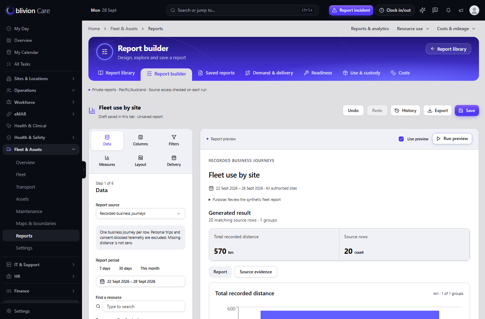

# PKG-09B corrections and authenticated application verification

The correction candidate resolves owner verification for T09B-01, T09B-02 and T09B-04. T09B-03 (genuine 125% browser zoom) remains open. The four prior canonical-history HTTP 403 failures are resolved in the fixture successor documented in FIXTURE-CORRECTION.md. Its six bounded regressions pass; Main review and the zoom acceptance/amendment remain pending. This packet does not grant production approval.

Candidate branch: codex/fleet-personal-reports. Fixture successor parent: ba2e0aeec341ff68dedbfafd4fb4d64642e8bd5b. Privacy correction parent: e4bb17b56405a748072bf83e8c30af323822e0bc. Original base: 926b4981b0289da08a20baca0995117fb53e413e. The exact correction commit is the commit containing this document and correction-manifest.json. The original packet is preserved as historical evidence.

## Privacy corrections (T09B-01)

Encrypted run payloads now retain a versioned, bounded snapshot of the source records actually read, before filtering, column projection, rounding, formulas, aggregation or comparisons. Comparison contributors are retained separately. Results revalidate those contributors before becoming ready, on every subsequent read, and through the existing export checks before and after rendering. A changed or deleted contributor invalidates the whole run, including totals, charts, formulas and pivots. Record IDs and hashes are excluded from public status and JSON export metadata.

This is deliberately conservative: ordinary source edits can require regeneration too. Older cached runs without this evidence version fail closed and must be regenerated. No schema migration is required. The snapshot has a fixed contributor limit rather than silently truncating dependencies.

Resource costs preserve the actual trip and fuel contributors behind aggregates. Resource contact metadata records fleet-state and last-trip dependencies; fresh reads also mask contact/tracking data when the linked last trip is personal or consent-blocked. Personal reports retain actual signal, telemetry, session, rule and monitor dependencies. The integration history reader has an optional report observer, preserving default interactive callers and the separate 500-point map limit. Canonical payload edits and new ambiguous legacy device links invalidate cached history.

## Canonical alert authorization (T09B-02)

Client and staff alert sources require ControlRoomAlertAccessService::canRead (view OR manage), together with existing personal client/session authority. Source queries and cached alert dependencies use applyReadableScope, including approved-site scope, canonical record ownership and controlled-medication content restrictions. Withdrawing controlled-content access invalidates an existing report even when its source is still available. Dashboard access alone does not confer alert access.

The application remains for one operating organisation across multiple sites. This correction adds no tenant selector, switching or tenant authorization boundary.

## Automated verification

The fixture successor passes six tests with 136 assertions. Latest deduplicated scoped evidence is 48 passing cases with 838 assertions and no remaining failures among those cases; see fixture-verification.json and FIXTURE-CORRECTION.md. The earlier privacy-correction evidence below is retained for traceability. At that point 43 cases passed with 796 assertions, while four canonical-history success fixtures returned HTTP 403; test-summary.json and final-tests.xml preserve that historical result.

- Initial Reports suite: 39 tests, 635 assertions, passed.
- Expanded run: 46 tests, 755 assertions, one test-fixture error and the four known baseline failures. The fixture error assumed a legacy physical payload column absent from this schema; the test was corrected to mutate canonical raw_payload.
- Corrected payload case: 1 test, 21 assertions, passed.
- Final resource personal/consent matrix and fleet-state case: 7 tests, 184 assertions, passed.
- Final production Vite build passed in 4m27s. Existing large-chunk warnings remain.
- Scoped TypeScript, workspace ESLint, Pint and git diff whitespace checks passed.

The cases cover private/consent-blocked trips, hidden columns and derived results, comparison-only contributors, privacy changes during reading and PDF rendering, legacy cached runs, canonical alert scope and permission withdrawal, canonical payload changes and newly ambiguous legacy device links. Repeated cases are counted once using their latest result; passing totals do not mean the expanded suite is wholly green.

## Authenticated application verification (T09B-04)

Verified URL: http://127.0.0.1:8974/fleet-assets/reports/builder

The server uses the actual Laravel/Inertia application and AppLayout from C:/Users/steph/.codex/worktrees/fleet-personal-reports/oblivionfindings. The separate adapter preview at port 8973 is not the source of this evidence. The synthetic preview database is of_pkg09b_browser_20484. Sign-in used normal Fortify password authentication and MFA. Only the synthetic account's invalid factory MFA placeholder was replaced with a valid encrypted secret; authentication middleware was not bypassed.

Verified browser workflows:

- Fleet library and six-step builder: 20 journeys and 570 km; accessible column reordering and live preview.
- Grouped filters: distance greater than 20 AND resource containing Synthetic returned 16 rows and 506 km.
- Resource-by-week pivot: four groups, total 570 km. Measure settings and Delivery controls were inspected.
- Turning off live preview and editing the definition disabled stale downloads. Export opened, but Download remained disabled until a current result was available.
- Saved Fleet planning — synthetic QA in QA reports, then reopened version 1 through Saved reports.
- Downloaded actual XLSX, PDF, CSV and JSON outputs. JSON reported 20 rows and 570 km and omitted private provenance. XLSX was 5,328 bytes; PDF was 28,999 bytes.
- Client personal-tracker report for Alex Sample (synthetic): one location observation.
- Staff report for Sam Worker (Synthetic): one location observation within the selected completed session.
- Desktop 1366×900 and mobile 390×844. Mobile builder steps, calendar and export dialog fit the viewport without page-level horizontal overflow.
- Final desktop builder and mobile library axe WCAG A/AA scans: zero violations in the scanned states. Header timezone text was corrected to white at 80% opacity and visually checked after rebuilding.

There were no recorded application page exceptions or failed local application HTTP responses. The optional external Bunny font request was blocked by the environment; the fallback font rendered. No external delivery was sent and no schedule was activated as part of browser QA. Genuine 125% browser zoom was not verified; the viewport checks are not zoom evidence.

The populated, authenticated in-app review tab is retained at the URL above. Build entry hashes are recorded in build-identity.json. browser-checks.json retains observations across the verification session, including responses from before the final contrast rebuild; build-identity.json and the final-named screenshots identify the final build.

## Match to the mockup

The implemented application follows the mockup's main composition: purple report header, Fleet navigation, six-step controls, adjacent result preview, summary metrics and report output. It is not a pixel-identical screenshot reproduction: the authenticated application has role-aware navigation, actual source values and personal-report purpose metadata. Final screenshots demonstrate the real application, and mockup-builder-1366.png preserves the reference for comparison.

## Scope and handback

Main remained read-only. The reviewed shared People Locations sources have no differences between the original Reports base and frozen PKG-03 fbb0eda96586ca751b73382eb90720abd6b8721a; the correction's optional history observer preserves default caller behavior. No unrelated package was merged or transferred. No push, deployment, operational database migration, collector or worker activation was performed.

All four isolated automated-test database families were removed; only the owned synthetic preview database is retained for review. Credentials, session cookies, MFA secrets, runtime preview helpers, generated build files and unrelated preview logs are excluded from the commit. The explicit correction-allowlist.txt contains ten application/test paths and this evidence packet. correction-manifest.json records the complete current application/test payload and correction evidence hashes.

The canonical-history fixture failures are resolved by the bounded successor. Main review and genuine 125% browser zoom acceptance/amendment remain pending. Owner verification here is not final integration or production sign-off.
