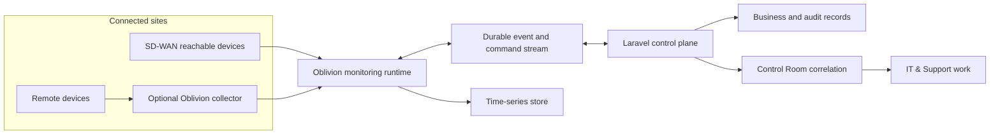

# IT & Support and Native Security & Devices Platform Design

**Date:** 2026-07-18

**Status:** Approved design direction; implementation planning awaits review of this committed specification

**Goal:** Transform the current IT/provisioning and Security & Devices surfaces into one complete, production-ready platform: an end-to-end service desk comparable in operational depth to ConnectWise or Zendesk, plus a fully independent Oblivion Findings monitoring and management system with PRTG/Auvik-class capabilities and UniFi-like clarity.

> **Single-tenant architecture decision:** Oblivion Findings serves one operating organisation across all of its sites. This design must not introduce organisation selection, organisation switching, partitioned-SaaS transports, or fictional organisation-isolation scenarios. Authorisation is enforced through roles and permissions, approved sites and networks, canonical record ownership, direct-object denial, and privacy rules. Legacy organisation-context columns in mature models are compatibility details only; new monitoring contracts and storage do not propagate them. See [`docs/architecture/single-tenant-application.md`](../../architecture/single-tenant-application.md).

## 1. Outcome

Oblivion Findings becomes the operational hub for every connected site. The main application observes all sites reachable through the organisation's SD-WAN and can use a hardened collector at remote, isolated, or unreliable sites. Security & Devices provides native discovery, monitoring, topology, alerting, history, and authorised device management. IT & Support converts requests, failures, changes, provisioning work, and monitoring findings into accountable work with queues, service levels, approvals, communications, knowledge, and auditable resolution.

PRTG and Auvik are capability references only. They are not runtime dependencies, branded surfaces, or sources of truth. The monitoring product is Oblivion Findings.

This is a modular platform, not a collection of disconnected screens. Existing canonical records remain authoritative, and other modules receive permission-aware projections and deep links instead of duplicate device, alert, ticket, or asset registers.

The complete operational journey is:

> Discover or request → Understand context → Correlate → Assign accountable work → Diagnose and act → Confirm outcome → Resolve → Learn and report

The goal remains active until all delivery streams and acceptance scenarios in this document are implemented and proven. A navigation refresh, a single monitoring protocol, or one ticket lifecycle is not completion.

## 2. Existing foundation and preservation contract

The implementation extends the current application instead of replacing working domain behaviour.

### Existing IT foundation

- `app/Models/ItTicket.php` is the current ticket record and already has comments, events, approvals, policy controls, and controller routes around it. It is the migration source for the richer service-desk work item.
- `app/Models/ItProvisioningRequest.php` and `app/Http/Controllers/It/ItProvisioningController.php` provide the current onboarding-linked provisioning queue. Provisioning becomes a first-class service-delivery workflow; it is not removed or reduced to an ordinary ticket category.
- `OnboardingService::createItProvisioningRequests()` remains the canonical HR onboarding bridge. Fulfilment must continue to update onboarding completion.
- Current references, URLs, permissions, comments, attachments, and audit history must survive migration.

### Existing Security & Devices foundation

- `app/Domain/SecurityDevices/Models/Device` remains the canonical physical or virtual device identity.
- Current assignments can link devices to sites, rooms, vehicles, staff, and clients. These relationships remain canonical and gain temporal history where required.
- Existing topology, groups, events, maintenance, documents, and asset links are preserved and evolved.
- Existing UniFi, Milesight, and Queclink integrations continue through the common integration boundary. Their provider-specific capabilities must not force provider-specific navigation for routine work.
- `routes/security-devices.php` and existing deep links remain compatible or receive explicit redirects.

### Existing operational-alert foundation

- `app/Services/ControlRoom/SignalProcessingService.php` remains the canonical signal correlation, idempotency, deduplication, maintenance-suppression, and operational-alert entry point.
- `app/Observers/DeviceEventObserver.php` remains the compatibility bridge from Security & Devices events into Control Room until producers publish through the durable signal contract directly.
- Monitoring must extend this path. It must not introduce a second alert engine, active-alert register, or competing incident workflow.

### Compatibility invariants

- Existing ticket and provisioning identifiers remain resolvable.
- Existing device identifiers remain stable.
- Existing integrations continue to sync while their adapter contracts are expanded.
- No migration reports success if links, history, canonical ownership, or site relationships are incomplete.
- Every destructive migration has a tested rollback or a documented forward-repair path when rollback would lose valid operational data.

## 3. Approaches considered

### A. Expand the Laravel application only

This keeps deployment simple, but long-running polling, topology computation, high-volume telemetry, command execution, and collector buffering would compete with web and business queues. It does not provide the fault isolation required of a monitoring platform.

### B. Modular control plane with dedicated monitoring runtimes — selected

Laravel/Inertia remains the control plane for identity, the single-organisation context, roles, site access, permissions, configuration, ticketing, approvals, audit, and UI. Dedicated Oblivion runtimes perform discovery, polling, topology processing, event intake, command execution, and collector synchronisation. Durable contracts join the runtimes without creating duplicate domain ownership.

This gives the product native monitoring depth while preserving the application's existing business and care context.

### C. Independent microservice for every device family

This offers maximum isolation but creates operational sprawl, repeated security boundaries, and inconsistent behaviour before the product needs that granularity. Provider plugins and capability-specific workers provide sufficient isolation within the selected modular runtime.

## 4. Platform architecture

### 4.1 Control plane

The Laravel/Inertia application owns:

- the single operating organisation, roles, permissions, and approved site boundaries;
- users, roles, site access, consent, and step-up authentication;
- canonical device identity and contextual assignments;
- discovery scopes, monitoring profiles, policy, and maintenance-window configuration;
- operational alerts and incidents through Control Room;
- IT work, service catalogue, SLAs, approvals, conversations, and knowledge;
- command authorisation and command-request state;
- audit, reporting definitions, and user-facing projections.

The control plane does not execute high-frequency polling inside web requests and does not give collectors database access.

### 4.2 Monitoring runtime

The central Oblivion monitoring runtime owns execution of:

- scheduled and on-demand discovery;
- availability, performance, sensor, service, certificate, interface, and flow checks;
- trap, syslog, webhook, and provider-event ingestion;
- topology inference and snapshot comparison;
- metric normalisation, downsampling, and retention enforcement;
- configuration and inventory collection;
- device commands dispatched from authorised control-plane requests;
- collector health and backlog supervision.

Runtime workers are divided by workload class so a slow SNMP estate, a video provider outage, or a large topology recalculation cannot starve urgent event processing.

### 4.3 Connectivity model

- The central runtime directly monitors sites reachable through the SD-WAN.
- A collector is optional for a remote, isolated, bandwidth-constrained, or intermittently connected site.
- A collector receives only its scoped configuration and expiring credentials or tokens.
- A collector buffers observations, events, and command results while disconnected and sends them in order when connectivity returns.
- The central application distinguishes `device unavailable`, `collector unavailable`, `site path unavailable`, and `data stale`; it never converts missing data into healthy status.
- Collectors cannot query the application database, enumerate unassigned sites, networks, or devices, or perform commands outside their signed scope.

### 4.4 Data stores and message flow

- MySQL stores business records, identity, configuration, current projections, tickets, approvals, links, and audit indexes.
- A durable event stream or queue carries versioned commands, observations, events, configuration changes, and projection updates.
- A time-series store holds high-volume metrics and aggregated history. MySQL stores stable references and useful current summaries, not every sample.
- Object storage holds configuration snapshots, evidence, exported diagnostics, and authorised media references under retention and access policy.
- Dead-letter handling, replay checkpoints, idempotency keys, and consumer lag are first-class operational signals.



### 4.5 Contract rules

Every message includes a schema version, source, site or approved scope reference where applicable, occurrence time, ingestion time, idempotency key, trace ID, and payload integrity metadata. The durable outbox, inbox, and dead-letter store preserves the exact canonical signed transport bytes so signature verification, payload hashes, and replay never depend on database-normalised JSON. Outbox and inbox delivery identity and signed bytes are immutable after creation; publisher and consumer both compare the exact transport identity before any acknowledged or already-processed shortcut. Dead-letter identity, trusted site context, reason evidence, signed bytes, fingerprint, and site-aware dedupe key are likewise immutable, while resolution and replay lifecycle fields remain auditable mutable state.

Immediate dispatch is an optimisation over durable state, not the only delivery mechanism. Unpublished outbox rows and pending replay intents carry bounded leases and generation tokens, and an every-minute recovery pass reclaims expired work under locked, skip-locked batches. Queue failure or process death cannot silently strand a committed row, and a stale job cannot complete a replacement intent. Successful replay consumes the original bytes and atomically resolves the letter with actor, reason, count, and audit; discard never deletes evidence. Dead letters carry nullable trusted canonical site routing context from authenticated intake; malformed or unauthenticated payload content is never trusted for authorisation, and genuinely unscoped failures require privileged operational access. Consumers are idempotent. Contract evolution is backward compatible for at least one deployed runtime version. Unsupported versions fail visibly and enter an actionable dead-letter queue.

## 5. Canonical domain ownership

| Concern | Canonical owner | Permitted projections |
| --- | --- | --- |
| Device identity, capabilities, telemetry, topology, configuration, firmware, device commands | Security & Devices | Site, Client Profile, HR, Fleet, Asset/Finance, IT, Control Room |
| Place, room, connectivity context, local contacts, criticality | Sites | Security & Devices, IT, Control Room |
| Clinical readings, care thresholds, clinical review, consent | Client Health Monitoring / Client Profile | Restricted device status link from Security & Devices |
| Person identity, employment lifecycle, manager, joiner/mover/leaver state | HR | IT provisioning and staff equipment links |
| Vehicle operations, journeys, driver assignment, compliance | Fleet | Tracking and vehicle-device health projections |
| Financial asset identity, ownership, warranty, depreciation, procurement | Asset/Finance | Device and ticket links |
| Operational signals, correlation, incidents, escalation | Control Room | Device and IT links |
| Requests, incidents, provisioning, problems, changes, service communications, SLA | IT & Support | Context panels in source modules |

Ownership means the source module controls mutation, lifecycle, permission decisions, and history. A projection can show status, links, and permitted actions but cannot silently create a second editable record.

Typed links replace unstructured JSON identifiers for new relationships. Events carry canonical IDs and snapshots needed for historical truth. Projection rebuilds are deterministic and never alter their source records.

## 6. Native monitoring model

### 6.1 Core records

- **Device:** stable canonical identity for hardware, software appliance, service endpoint, camera, alarm panel, access component, healthcare device, tracker, sensor, or managed virtual component.
- **Device capability:** declared or discovered functions such as network polling, camera stream, door control, location, clinical data transport, configuration backup, or remote command.
- **Discovery scope:** site- and network-scoped CIDRs, seeds, provider accounts, protocols, exclusions, schedules, rate limits, and collector assignment.
- **Discovery run:** immutable execution summary with found, matched, proposed, changed, excluded, failed, and unresolved results.
- **Discovery candidate:** reviewed identity proposal before a new canonical device is created or merged.
- **Monitoring profile:** reusable policy for checks, thresholds, dependencies, schedules, retention, escalation, and device-class defaults.
- **Monitor:** one applied check against a device, interface, sensor, service, certificate, endpoint, or logical dependency.
- **Metric series:** normalised metric identity, dimensions, units, source, retention tier, and time-series pointer.
- **Observation:** individual or aggregated measured state used for history and rule evaluation.
- **Device event:** durable significant state change or provider event with source evidence.
- **Topology snapshot and edge:** time-bound nodes, connections, confidence, evidence source, and change set.
- **Configuration snapshot:** encrypted or access-controlled versioned configuration or inventory evidence with diff metadata.
- **Credential profile:** secret-manager reference and permitted protocol/capability scope; never plaintext credentials in application tables or logs.
- **Command request:** authorised desired action, target, parameters, risk, approvals, expiry, idempotency, execution result, and reconciliation state.

### 6.2 Supported native collection

The platform supports capability-driven adapters for:

- ICMP reachability and latency;
- TCP port and service availability;
- DNS resolution and record checks;
- HTTP/HTTPS availability, content, latency, and transaction checks;
- TLS certificate validity, hostname, issuer, and expiry;
- SNMPv3 polling, discovery, traps, interface counters, sensors, inventory, and supported configuration data;
- SSH and WinRM for explicitly approved inventory, service, performance, and management operations;
- syslog and event normalisation;
- flow telemetry where devices support NetFlow, IPFIX, sFlow, or provider equivalents;
- LLDP, CDP, ARP, forwarding tables, routes, and provider topology sources;
- authenticated provider APIs, including existing UniFi, Milesight, and Queclink adapters;
- signed webhooks and secure API events from approved systems.

SNMPv1/v2c can be enabled only as a recorded compatibility exception with restricted scope and migration visibility. Default setup guides users toward SNMPv3.

#### 6.2.1 Probe authorisation boundary

Every direct probe begins with an immutable requested target plus explicit canonical Site and Device IDs. A canonical resolver must independently prove that the active Device has current assignment evidence resolving to exactly one active, non-archived Site before any network authority is requested. Site, room, active client, current staff profile, and active vehicle assignments are supported; vehicle evidence includes the canonical vehicle category relation and linked-client Site. Zero, missing, future, inactive, or conflicting evidence fails closed.

Approved CIDRs, ports, and tighter transport limits come from a separate trusted discovery-scope provider. Until the persisted discovery-scope owner is implemented, that provider and DNS resolution are both bound to rejecting defaults. This makes a missing integration non-operational rather than broadening scope.

The egress policy resolves a hostname once, requires every A/AAAA result to pass both the global special-use/metadata deny list and the exact approved Site scope, then issues a private-construction authorised target containing the pinned numeric address set and bounded connect, response, and body limits. Only the egress policy may mint that transport target. Every redirect repeats full authorisation, HTTPS cannot downgrade, and adapters may not perform an unverified second lookup. URLs carrying credential-like query parameters are rejected; later credentialed adapters receive ephemeral leases or secret references, never reusable URL credentials.

This boundary authorises transport only. ICMP, TCP, DNS, HTTP, TLS, and other adapter execution remains owned by the runtime implementation tasks and is not implied by the authorisation contract.

### 6.3 Discovery and identity matching

Discovery combines IP ranges, known seeds, ARP and forwarding data, LLDP/CDP, provider inventories, cloud APIs, and collector-local visibility. It proposes matches using serial number, hardware ID, MAC address, provider ID, certificate identity, hostname, address history, and device fingerprint.

Automatic matching requires high-confidence immutable evidence. Ambiguous candidates enter a review queue showing why a match was proposed. Merge and split operations preserve source identifiers and history, are audited, and support repair. Discovery never creates multiple canonical devices merely because more than one integration observed the same equipment.

### 6.4 Monitoring semantics

- Check states are `pending`, `healthy`, `degraded`, `failed`, `unknown`, `stale`, `suppressed`, or `not_applicable`.
- Health rolls up from monitor to device, dependency, site, workspace, and estate using explicit policy. Unknown or stale data cannot improve a roll-up.
- State changes use configurable consecutive-failure, duration, hysteresis, and recovery confirmation rules.
- Dependency suppression identifies downstream symptoms without erasing them. Operators can see the symptoms, the suppression reason, and the proposed root cause.
- Maintenance suppresses notification and ticket automation according to policy while preserving observations and state history.
- Baselines and anomaly rules use explainable bounds and display the values that caused the finding.
- Monitoring profiles expose which expected checks are missing, unsupported, paused, or failing to collect.

### 6.5 Retention

Retention is tiered by data class and policy:

- recent raw samples for diagnostics;
- medium-term downsampled series for capacity and trend analysis;
- long-term aggregates for reporting and forecasting;
- durable state transitions, alerts, ticket links, command results, and audit evidence for their governed retention period.

Organisation policy, legal holds, privacy obligations, data ownership, and clinical separation override default retention. Deletion produces an auditable tombstone without retaining the deleted sensitive payload.

## 7. Security & Devices information architecture

The experience uses three navigation layers. The global application remains simple, the module can grow without becoming a wall of tabs, and each specialist workspace stays understandable.

### 7.1 Global navigation

The global main navigation contains one **Security & Devices** entry. Tracking, healthcare devices, cameras, alarms, access control, networking, and monitoring do not become unrelated top-level application modules.

### 7.2 Grouped module side navigation

**Overview**

- Estate overview
- Sites
- All devices

**Workspaces**

- Network & IT
- Security
- Healthcare
- Tracking
- Facilities & IoT

**Operations**

- Monitoring
- Maintenance

**Setup**

- Discovery & collectors
- Integrations
- Settings & audit

The side navigation shows only destinations the user can view. Counts represent actionable, permission-scoped work and use consistent definitions across pages.

### 7.3 Local workspace tabs

**Security**

- Overview
- CCTV
- Alarms
- Access Control
- Security events

Access Control covers doors, locks, readers, credentials, schedules, access history, state, and authorised control actions. It is not omitted and is not buried under generic devices.

**Tracking**

- Overview
- Personal safety
- Fleet tracking
- Asset tracking
- Geofences
- History

Personal, fleet, and asset tracking share mapping infrastructure but retain distinct consent, purpose, retention, assignment, and workflow rules.

**Healthcare**

- Overview
- Client devices
- Shared/site devices
- Connectivity & data flow
- Calibration & maintenance

Healthcare device pages show technical state, assignment, battery, connectivity, integration flow, calibration, maintenance, and data-delivery status. Clinical values, thresholds, and clinical review remain in Client Health Monitoring.

**Network & IT**

- Overview
- Network map
- Devices
- Interfaces
- Services
- Traffic and capacity
- Configuration and firmware

**Facilities & IoT**

- Overview
- Environmental sensors
- Building systems
- Utilities
- Automations
- History

### 7.4 Page patterns

- Estate overview answers what is unhealthy, what changed, what is unmonitored, which sites are affected, and what needs action.
- Site view combines site health, WAN path, topology, device groups, open alerts, active IT work, maintenance, collector state, and recent changes.
- All devices is a powerful inventory with saved views, bulk selection, export permissions, and clear ownership/context columns.
- Device profile uses a concise summary header and purpose-driven sections for health, monitors, topology, interfaces/sensors, configuration, assignments, tickets, events, maintenance, documents, and audit. Capability-specific controls appear only when supported.
- Monitoring is an operational workspace for active findings, monitor coverage, dependencies, trends, capacity, and data-collection health.
- Setup surfaces make missing credentials, excluded ranges, unsupported checks, collector lag, and integration errors visible and actionable.

Status, severity, date/time, tables/cards, keyboard focus, touch targets, empty states, and destructive confirmations follow the application's shared UI standards. Provider implementation details are available for diagnosis but do not dominate routine screens.

## 8. IT & Support service-management model

The module is renamed **IT & Support**. Provisioning remains a first-class workflow inside it.

### 8.1 Navigation

**Service Desk**

- Overview
- Tickets
- Queues
- Major incidents

**Service Delivery**

- Requests
- Provisioning
- Problems
- Changes
- Knowledge

**Operations**

- SLAs
- Automations
- Reports

**Setup**

- Service catalogue
- Forms
- Teams
- Email/API channels
- Settings

### 8.2 Work types

- **Incident:** restore an interrupted or degraded service.
- **Service request:** fulfil a standard user need.
- **Provisioning:** deliver or revoke access, equipment, accounts, and setup through a task/approval workflow.
- **Problem:** investigate root cause across one or more incidents and maintain workarounds or known errors.
- **Change:** assess, approve, schedule, implement, validate, and, if required, back out a controlled alteration.
- **Security request:** restricted work such as access, credential, security-policy, evidence, or privacy operations.
- **Major incident:** coordinated response with commander, timeline, communications, related tickets, impacted services/sites, recovery, and review.

These types share a work foundation but retain type-specific lifecycle rules. They are not implemented as category labels over one unrestricted status field.

### 8.3 Shared work foundation

Every work item supports, as applicable:

- requester, affected user/client, source channel, source record, canonical ownership, and official reference;
- site, service, device, asset, vehicle, room, and integration links;
- impact, urgency, calculated priority, severity, and restricted/sensitive marker;
- queue, team, assignee, owner, watchers, followers, and escalation owner;
- SLA policy, response target, resolution target, pauses, breaches, and operating calendar;
- public conversation, internal notes, email thread, attachments, and delivery state;
- tasks, dependencies, checklist templates, approvals, fulfilment items, and evidence;
- status, status reason, waiting party, next action, due date, and resolution code;
- immutable event timeline and mutation audit;
- related work, duplicate/master relationship, parent/child relationship, monitoring alert, problem, change, and knowledge links;
- customer satisfaction request and result when appropriate.

### 8.4 Intake channels

- Help Centre self-service forms and service catalogue.
- Inbound support email with threading, deduplication, attachment controls, delivery tracking, and reply routing.
- Technician-created work.
- HR joiner, mover, leaver, and employment-event workflows.
- Monitoring and Control Room automation.
- Contextual actions from Site, Client Profile, HR, Fleet, Asset, and Security & Devices.
- **Secure API for approved systems** using scoped service identities, signed or strongly authenticated requests, idempotency, rate limits, audit, and explicit field permissions.

Every intake channel creates the same canonical work record and timeline. Channel-specific data is retained as source evidence rather than becoming a separate ticket store.

### 8.5 Help Centre

The requester experience provides:

- search-first knowledge and service catalogue;
- plain-language dynamic forms that collect useful context without exposing internal routing;
- "My requests" with status, next step, conversation, approvals, appointments, and supplied items;
- requester actions for reply, attachment, cancellation, approval, confirmation, or reopening when policy permits;
- clear separation between service request, outage, access/security request, and general question;
- accessible confirmation and reference after submission.

### 8.6 Service-desk workspace

The technician ticket workspace shows summary, requester/context, SLA clock, conversation, internal collaboration, related devices/assets/services, monitoring evidence, tasks/approvals, linked problem/change/major incident, and complete timeline without forcing repeated page changes.

Queues support team ownership, assignment, triage, saved filters, views, bulk actions with per-item results, workload, SLA risk, waiting reason, site, service, and work type. "Unassigned", "waiting for requester", "waiting for vendor", "waiting for change", "breached", and "monitoring recovered but ticket open" are explicit states or filters.

### 8.7 Lifecycle rules

- State transitions are services with permission, prerequisite, timestamp, actor, SLA, automation, and audit updates in one transaction.
- Waiting states require a waiting party/reason and apply only the SLA pause allowed by policy.
- Resolution requires a resolution code, resolution summary, and completion of required tasks/approvals.
- Closure can be automatic after a configured confirmation period or manual under policy; reopening creates an audited transition and restores the appropriate SLA behaviour.
- Duplicate tickets link to a master and retain their requester conversations and notification obligations.
- Deleted email or failed delivery never disappears silently; delivery failures become technician-visible work.

### 8.8 Provisioning

Provisioning templates define ordered or parallel tasks, responsible teams, approvals, required evidence, fulfilment targets, dependencies, and reversal tasks. Joiner/mover/leaver events select templates based on role, site, employment type, and policy.

Provisioning can cover accounts, groups, licences, email, devices, peripherals, network/Wi-Fi, door credentials, training prerequisites, telephony, vehicle technology, healthcare access, and returned equipment. Restricted tasks reveal only the minimum necessary data to each fulfiller.

Fulfilment updates the existing onboarding bridge. Leaver workflows revoke access and recover assets using the same canonical device, credential, and asset links. Failed or incomplete steps cannot falsely mark onboarding/offboarding complete.

### 8.9 Problems, changes, knowledge, and reporting

- Problems relate incidents, known errors, workarounds, root cause, corrective actions, and permanent-fix changes.
- Changes include risk, impact, affected services/devices/sites, implementation plan, validation plan, backout plan, approvals, maintenance window, command links, actual outcome, and post-implementation review.
- Knowledge has draft/review/publish/retire lifecycle, audience and site scope, ownership, review date, feedback, related services, and ticket deflection evidence.
- Reports cover demand, backlog age, response/resolution SLA, reopen rate, first-contact resolution, channel, customer satisfaction, major incidents, change success, recurring problems, provisioning lead time, automation outcome, device/service reliability, and data-quality gaps.

Reports expose definitions and filters so a dashboard count can be reconciled with its underlying records.

## 9. Monitoring-to-ticket lifecycle

Monitoring produces observations and device events. Control Room remains the canonical operational correlation layer. IT & Support owns accountable technical work.

```mermaid
sequenceDiagram
    participant M as Monitoring runtime
    participant C as Control Room correlation
    participant I as IT & Support
    participant T as Technician
    M->>C: Confirmed state change with dependency and evidence
    C->>C: Deduplicate, suppress, correlate, identify root cause
    C->>I: Create or update one linked work item by policy
    I-->>T: Queue, SLA, context, and diagnostic evidence
    M->>C: Additional symptoms or repeated observations
    C->>I: Append evidence and impact; do not duplicate work
    T->>I: Diagnose, communicate, act, and record outcome
    M->>C: Confirmed recovery
    C->>I: Mark monitoring recovered and append evidence
    T->>I: Resolve after service and work validation
```

### 9.1 Trigger and correlation rules

- A monitor must pass configured debounce and confirmation rules before a failure or recovery state change is emitted.
- Maintenance and dependencies are evaluated before notification and ticket automation.
- Signal processing uses site, service, canonical device, topology, condition, time, source, and known dependency context to identify one correlation.
- One root-cause IT incident is created when policy requires accountable technical work. Downstream symptoms relate to that incident and remain visible as suppressed or correlated evidence.
- Repeated observations update impact, timeline, and evidence. They do not create one ticket per poll.
- Materially distinct failures can create separate work even within the same time window; idempotency cannot erase legitimate incidents.

### 9.2 Recovery and closure

- Monitoring recovery resolves the operational finding after recovery confirmation.
- Recovery updates the linked IT work to "monitoring recovered" and records the recovery evidence.
- A technician controls ticket resolution unless an explicit, low-risk policy allows auto-resolution and all prerequisites are satisfied.
- Recovery cannot erase open tasks, pending change validation, requester impact, or an unresolved root cause.
- A resolved ticket reopening because the same condition recurs retains the original correlation where policy says it is the same incident; otherwise it links a new incident to the recurring problem.

### 9.3 Failure modes

- Consumer retries are idempotent and preserve original occurrence time.
- Poison messages enter a permission-scoped dead-letter worklist with replay and discard audit.
- Collector outage produces one collector/site-path correlation, marks affected data stale, and suppresses false per-device outage tickets while retaining the affected-device list.
- A central runtime outage is monitored externally and through independent heartbeat paths so it cannot claim the estate is healthy.
- Clock drift, sequence gaps, backlog age, dropped samples, unsupported checks, and partial provider responses are visible monitoring-health findings.

## 10. Cross-module experience

### 10.1 Site Profile

A **Technology** section shows site health, WAN/SD-WAN path, collector, topology summary, device groups, unmonitored assets, active monitoring findings, open IT work, maintenance, recent changes, and primary technology contacts. It opens canonical Security & Devices or IT records for action.

### 10.2 Client Profile

A **Healthcare Devices** section shows devices assigned to the client, technical/connectivity state, last successful data flow, battery, calibration/maintenance, support contact, and open authorised work. Clinical readings and thresholds remain in Client Health Monitoring.

Cameras, general alarms, access logs, and unrelated site devices do not appear in Client Profile merely because the client is present at the site. Any safety-device or personal-tracker projection requires purpose and consent.

### 10.3 HR

An **Equipment & Access** section shows assigned devices, asset references, account/access fulfilment, door credentials, provisioning tasks, return obligations, and open IT work. HR owns the employment event; IT owns fulfilment; Security & Devices owns the device or credential state.

### 10.4 Fleet

A **Vehicle Technology** section shows installed trackers, cameras, gateways, sensors, connectivity, last contact, firmware/configuration state, monitoring findings, and linked work. Fleet remains authoritative for vehicle, driver, journey, and compliance workflows.

### 10.5 Asset/Finance

Device pages show authorised asset/procurement/warranty links. Financial fields remain owned by Asset/Finance. Disposal must reconcile device, assignment, access, configuration, and asset state through an audited workflow.

### 10.6 IT & Control Room

Tickets show live permission-aware device/site/service context and frozen incident-time evidence. Control Room shows the correlated topology/device context and linked IT work without becoming the service-desk queue.

## 11. Privacy, permissions, and sensitive data

### 11.1 Permission model

Access is evaluated across organisation role, permission, approved site, workspace, device class, canonical ownership, data sensitivity, relationship, and capability. UI capabilities are server-provided; route and service policies enforce the same decision.

Operational capability levels are:

- **Observe:** view permitted inventory, health, and history.
- **Operate:** acknowledge findings, run approved diagnostics, and perform low-risk actions.
- **Manage:** configure monitoring, assignments, maintenance, and standard device management.
- **Control:** perform safety/security/availability-affecting commands under command policy.
- **Admin:** manage integrations, collectors, credential references, permission policy, and governed exports.

Holding a module-level role does not bypass site or sensitive-data restrictions.

### 11.2 Double permission gate

Sensitive cross-module projections require permission from both the source domain and the destination context. Examples include client-linked healthcare devices, personal tracking, staff equipment, camera evidence, access history, and security requests. Failure returns a non-revealing response and is audited where required.

### 11.3 Tracking and location

- Every personal tracking assignment records person, purpose, lawful basis/consent, start, expiry, access audience, retention, and withdrawal outcome.
- Staff location is limited to approved safety and operational purposes; it is not a general productivity-surveillance feature.
- Client tracking follows care consent and representative rules.
- Fleet and asset tracking have distinct purpose and retention policies.
- Consent withdrawal or assignment end stops new access and collection according to policy, revokes projections, and triggers governed retention handling.
- Geofence and location exports require explicit permission, reason, scope, and audit.

### 11.4 Healthcare and media separation

- Technical healthcare-device telemetry is separate from clinical readings.
- Clinical payloads do not enter general monitoring metrics, ticket descriptions, emails, logs, or analytics.
- CCTV streams, snapshots, and exports use provider-secure delivery and short-lived access. Routine inventory pages do not embed unrestricted live video.
- Evidence export records requester, reason, scope, watermark/reference, retention, and access events.

## 12. Device management and high-risk commands

Security & Devices is a management platform as well as a monitoring platform. Management is capability-driven and subject to risk policy.

### 12.1 Command flow

1. Validate approved site and network scope, canonical device ownership, capability, current state, user permission, and requested parameters.
2. Classify risk and require a reason, step-up authentication, approval, maintenance/change link, or break-glass declaration as policy dictates.
3. Create an expiring, signed, idempotent command request with expected state and reconciliation rules.
4. Dispatch to the central runtime or correct collector.
5. Record accepted, started, succeeded, failed, expired, cancelled, or uncertain execution state.
6. Re-observe the target and reconcile actual state before presenting success.
7. Append immutable actor, approver, target, parameters-safe summary, runtime, timing, result, and evidence to audit.

### 12.2 High-risk examples

- door unlock, door lockdown, access schedule, and credential grant/revoke;
- alarm arm/disarm, bypass, reset, and emergency-mode changes;
- camera privacy mode, stream sharing, recording changes, and evidence export;
- remote shell, remote control, reboot, wipe, firmware, configuration, firewall, and security-policy changes;
- broad monitoring suppression or maintenance across critical services;
- healthcare device control, calibration override, or data-flow rerouting;
- bulk commands affecting multiple sites or safety-critical devices.

High-risk commands do not blindly retry after an uncertain response. The system reconciles actual state and requires an informed next action. Bulk execution records a result per target and never reports blanket success when only some targets changed.

### 12.3 Break glass and secrets

Break-glass access requires an explicit reason, short expiry, heightened audit, immediate notification to designated reviewers, and post-use review. It does not reveal reusable secrets.

Credentials are held in an approved secret manager. Application records contain references and scope only. Runtime delivery uses short-lived or encrypted material, redacts logs and errors, and supports rotation without rewriting monitor history. Collectors store the minimum encrypted working set and erase expired material.

## 13. Integration platform

The current integration interface expands into capability-specific contracts instead of one provider-shaped abstraction. Adapters can implement:

- connection test and authenticated health;
- inventory discovery and identity evidence;
- device and assignment synchronisation;
- monitor/sensor catalogue and current state;
- metric and observation collection;
- events, traps, syslog, and webhook verification;
- topology nodes, edges, and confidence evidence;
- configuration/inventory snapshot collection;
- command capability declaration and execution;
- rate-limit, pagination, cursor, retry, and backfill state.

An adapter declares supported capabilities, version, limits, required permissions, data sensitivity, and safe polling bounds. Unsupported operations are absent from the UI and APIs rather than failing after a user attempts them.

Integration setup includes credential test, scope preview, duplicate-match preview, initial-sync plan, rate-limit estimate, health monitoring, and a clear disconnect/revoke path. Sync errors are actionable and never silently overwrite higher-confidence canonical data.

## 14. Migration and cutover

### 14.1 Data migration

- Add the new work-item foundation around existing IT tickets with a compatibility layer during cutover.
- Backfill work type, source, queue, status mapping, priority inputs, SLA state, requester, and typed links from existing ticket data.
- Preserve comments, approvals, events, attachments, references, timestamps, and actors.
- Convert current provisioning records into first-class provisioning workflows while retaining onboarding links and fulfilment outcomes.
- Backfill monitoring records from current device health/events without inventing historical samples that were never collected.
- Reconcile duplicate integration observations against canonical devices with an auditable candidate review for ambiguous matches.

### 14.2 Route and API compatibility

- Existing authorised routes either render the evolved workspace or redirect to the canonical destination while preserving query/context.
- Existing automation/API consumers receive a versioned compatibility period and explicit deprecation telemetry.
- New APIs use service identities, scoped tokens, idempotency keys, schema versions, rate limits, and audit from first release.

### 14.3 Cutover controls

- Feature flags separate read projection, dual-write verification, canonical-write cutover, and legacy-path retirement.
- Dual-write is used only with reconciliation and drift reporting; it is not an indefinite operating mode.
- Migration rehearsal runs against production-shaped, anonymised volume.
- Backups, restore rehearsal, queue drain, runtime version compatibility, and rollback/forward-repair criteria are documented for each release.
- Production deployment requires separate operational authorisation. Production-ready code and runbooks are part of this goal; an unauthorised live deployment is not.

## 15. Delivery structure

The master goal is delivered through bounded implementation plans and workstreams under one completion ledger. Each plan preserves the contracts in this document. Completion of one stream cannot close the master goal.

### Stream 1 — Foundations

- schema and domain contracts;
- work-item and typed-link foundation;
- runtime/event contracts and time-series boundary;
- site/role/ownership/capability permission framework;
- audit, secrets, idempotency, and feature-flag foundations;
- migration and reconciliation harness.

### Stream 2 — Connected vertical lifecycle

- one SD-WAN-reachable network device;
- native discovery and identity match;
- monitors, metrics, topology, and health roll-up;
- Control Room correlation;
- one linked IT incident with SLA and evidence;
- confirmed recovery and technician resolution;
- Site and device projections;
- browser and failure-path proof.

This stream proves the architecture but does not complete the master goal.

### Stream 3 — Complete IT & Support

- Help Centre, service catalogue, forms, requester portal, email, secure API;
- incidents, requests, queues, SLAs, communications, collaboration, automation, CSAT;
- provisioning and HR joiner/mover/leaver;
- problems, changes, knowledge, major incidents, reports, admin and audit.

### Stream 4 — Complete Security & Devices

- layered navigation and estate/site/device workspaces;
- Network & IT, Security, Healthcare, Tracking, Facilities & IoT;
- discovery, collectors, protocols, monitoring coverage, topology, capacity, configuration, maintenance;
- existing provider integrations under expanded contracts;
- authorised management and high-risk command workflows.

### Stream 5 — Cross-module projections

- Site Technology;
- Client Healthcare Devices with clinical separation;
- HR Equipment & Access;
- Fleet Vehicle Technology;
- Asset/Finance links;
- Control Room and IT shared context;
- consent, privacy, retention, and double-permission proof.

### Stream 6 — Production hardening and closure

- scale, fault isolation, backpressure, replay, dead-letter, collector loss, runtime health, and disaster recovery;
- security review, secret rotation, break-glass review, penetration tests, and site/role/direct-object/privacy isolation tests;
- migration rehearsal, runbooks, observability, capacity targets, accessibility, and supported-browser proof;
- completion-ledger audit against every acceptance scenario and evidence gate.

## 16. End-to-end acceptance scenarios

The implementation must prove all of the following with production-like records and no placeholder actions.

### 16.1 Self-service request

A requester finds knowledge, submits a catalogue request, receives a reference, follows conversation/status, supplies an approval or information request, sees fulfilment, and receives closure/CSAT. The technician sees the same canonical work with correct queue and SLA.

### 16.2 Email threading

An inbound email creates one ticket; replies and attachments thread to it; duplicate delivery is idempotent; spoofing and unsafe attachments are rejected or quarantined visibly; outbound delivery and bounce state are shown.

### 16.3 Joiner, mover, and leaver

An HR event creates the correct provisioning workflow, approvals, accounts, equipment, licences, network/access credentials, and due dates. Fulfilment updates onboarding. A mover changes only required items. A leaver revokes access and recovers linked assets without exposing restricted HR data.

### 16.4 Network failure

A monitored dependency fails. Debounce confirms it, topology suppresses downstream symptoms, Control Room creates one root-cause correlation, IT receives one linked incident with site/device/service evidence and SLA, repeats update it, recovery is confirmed, and the technician validates and resolves it.

### 16.5 Healthcare device

A healthcare device is discovered or integrated, assigned to a client under permission, shown in Security & Devices and Client Profile with technical/data-flow state, calibrated/maintained, and linked to IT work. Clinical values remain available only through the clinical domain.

### 16.6 Tracking consent withdrawal

A personal tracker assignment has purpose, consent, audience, and retention. Withdrawing consent stops permitted collection/access, removes the projection, preserves only governed audit/history, and prevents access through direct URL, export, API, or cached view.

### 16.7 Door control

An authorised user requests door action, supplies reason and step-up authentication, receives approval when policy requires it, dispatches one signed command, sees actual-state reconciliation, and produces immutable audit. An unauthorised user learns no sensitive state and cannot replay the command.

### 16.8 Collector outage

A remote collector loses connection. The site becomes collector/path unavailable and device data becomes stale, not failed or healthy. One correlated finding is created, per-device ticket noise is suppressed, buffered data returns in order, and gaps/backlog are visible.

### 16.9 Role, site, ownership, and privacy denial

Users without the required role, approved site, canonical ownership relationship, sensitive-domain permission, or command capability cannot view, search, export, infer counts, open direct links, mutate, or call APIs for restricted records. Both source and destination permissions are enforced on cross-module projections.

## 17. Verification and evidence gates

### 17.1 Automated evidence

- Domain tests for every lifecycle, prerequisite, invariant, idempotency key, state roll-up, and retention rule.
- Integration tests for each protocol/adapter capability, pagination, rate limit, retry, partial response, and identity match.
- Versioned contract tests across control plane, central runtime, collectors, and secure API clients.
- Queue tests for retry, replay, ordering, dead-letter, consumer lag, duplicate delivery, and poison messages.
- Security tests for site and role isolation, canonical ownership, field-level redaction, forged direct-object access, sensitive projections, commands, step-up, approval, break glass, and secret leakage.
- Migration tests against representative legacy records, rollback or forward repair, reference preservation, and reconciliation.
- Browser tests for every acceptance journey at supported desktop widths plus the module's required responsive behaviour.
- Accessibility checks for keyboard navigation, focus, labels, status meaning, colour independence, dialogs, tables/cards, and live updates.
- Frontend unit tests, PHP tests, static/type checks, formatting, client build, and SSR build.

### 17.2 Operational evidence

- Load and soak tests for expected device, monitor, metric, event, ticket, email, and command volume.
- Measured detection, ingestion, correlation, projection, and notification latency.
- Collector disconnection and buffered recovery test.
- Central runtime component failure and recovery test.
- Database, stream, time-series, object-store, and secret-manager restore rehearsal.
- Credential rotation and revoked-collector test.
- Runbooks for provider outage, queue backlog, false alert storm, compromised credential, failed command, stale estate, failed migration, and regional outage.

### 17.3 UX evidence

- Estate, site, device, Monitoring, each specialist workspace, Help Centre, queue, ticket, provisioning, problem, change, knowledge, and admin surfaces use production-backed data.
- Every displayed action works or is absent; disabled actions state the real prerequisite.
- Empty, loading, stale, partial, permission-denied, error, and recovery states are verified.
- Counts reconcile with their drill-down records and permission scope.
- Cross-module links open the canonical record and preserve meaningful return context.

## 18. Definition of complete

The goal is complete only when:

- all six delivery streams are implemented;
- every end-to-end acceptance scenario passes;
- automated, operational, security, migration, browser, accessibility, build, and SSR evidence is recorded in the completion ledger;
- existing ticket, provisioning, onboarding, device, integration, Control Room, and deep-link behaviour is preserved or deliberately migrated;
- there are no placeholder records, mock-only dashboards, inert buttons, duplicate canonical stores, or undocumented acceptance gaps;
- remaining defects are either resolved or explicitly accepted by the user with impact and evidence;
- merged/pushed state and acceptance-verified state are reported separately;
- live deployment is reported separately from production readiness and occurs only with explicit authority.

The implementation plan must decompose this specification into reviewable work while retaining one traceable acceptance matrix. No individual phase or test subset may claim that this master goal is complete.
